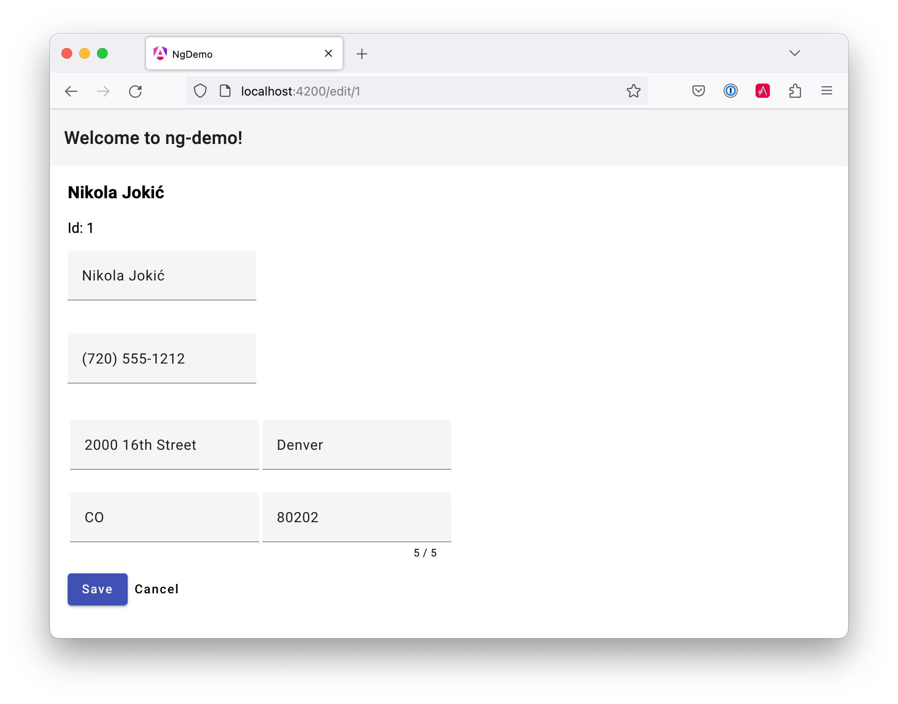

BrowserAnimationsModule,
    MatButtonModule,
    MatIconModule,
    MatInputModule,
    MatListModule,
    MatToolbarModule
== Bonus: Angular Material

To integrate Angular Material into your Angular CLI-generated app, complete the following steps.

----
ng add @angular/material
----

This will add Angular Material's stylesheet to your `angular.json` file, add stylesheets to your `index.html`, add dependencies to `package.json`, and add the `BrowserAnimationsModule` to your `app.module.ts`.
You'll still need to add the Material component modules as imports in `app.module.ts`:
[source,javascript]
.src/app/app.module.ts
----
import { MatButtonModule, MatIconModule, MatInputModule, MatListModule, MatToolbarModule } from '@angular/material';
@NgModule({
  ...
  imports: [
    ...
    MatButtonModule,
    MatIconModule,
    MatInputModule,
    MatListModule,
    MatToolbarModule
  ]
----

After modifying your HTML to match this branch, the edit screen will look as follows.

[[angular-material]]
.Angular Material

All of the HTML files in this `angular-material` branch have been modified to use Angular Material.

To learn more, see Angular CLI's https://github.com/angular/angular-cli/wiki/stories-include-angular-material[include Angular Material story].
