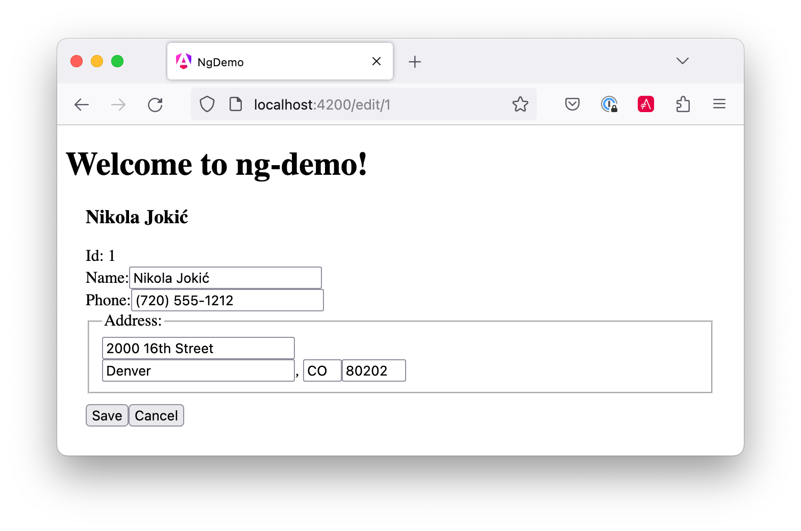
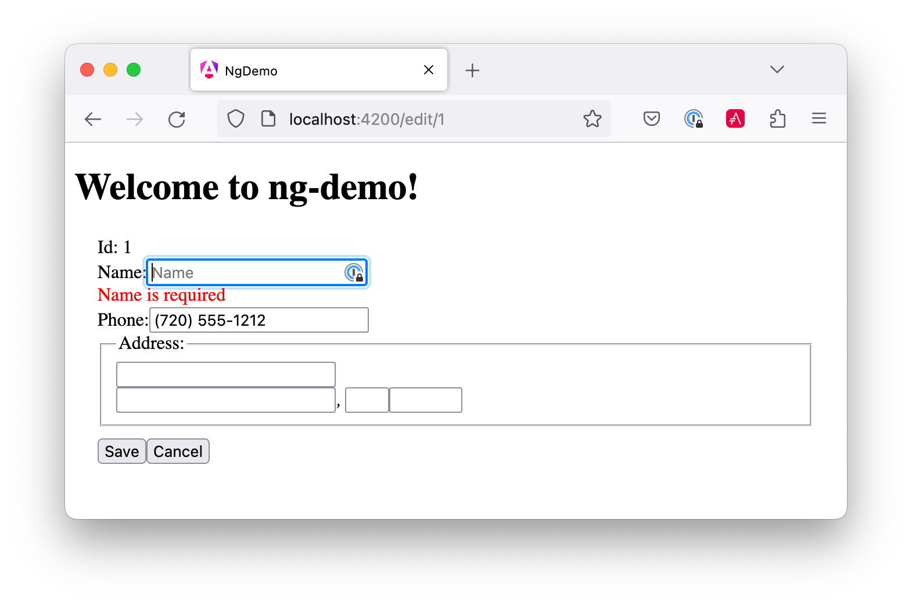

= Angular and Angular CLI Tutorial

:author: Matt Raible
:email:  matt@raibledesigns.com
:revnumber: 1.7
:revdate:   {docdate}
:subject: Angular CLI
:keywords: Angular CLI, Angular, JavaScript, TypeScript, node, npm, Jasmine, Protractor
:icons: font
:lang: en
:language: javadocript
:sourcedir: .
ifndef::env-github[]
:icons: font
endif::[]
ifdef::env-github,env-browser[]
:toc: preamble
:toclevels: 2
endif::[]
ifdef::env-github[]
:status:
:outfilesuffix: .adoc
:!toc-title:
:caution-caption: :fire:
:important-caption: :exclamation:
:note-caption: :paperclip:
:tip-caption: :bulb:
:warning-caption: :warning:
endif::[]
:toc:

This tutorial shows you how to build a simple search and edit application using https://angular.io[Angular] and
https://github.com/angular/angular-cli[Angular CLI].

ifdef::env-github[]
TIP: It appears you're reading this document on GitHub. If you want a prettier view, install https://chrome.google.com/webstore/detail/asciidoctorjs-live-previe/iaalpfgpbocpdfblpnhhgllgbdbchmia[Asciidoctor.js Live Preview for Chrome], then view the https://raw.githubusercontent.com/mraible/ng-demo/master/README.adoc[raw document]. Another option is to use the http://gist.asciidoctor.org/?github-mraible/ng-demo//README.adoc[DocGist view].
endif::[]

.Source Code
****
If you'd like to get right to it, the https://github.com/mraible/ng-demo[source is on GitHub]. To run the app,
use `ng serve`. To test it, run `ng test`. To run its integration tests, run `ng e2e`.
****

toc::[]

== What you'll build

You'll build a simple web application with Angular CLI, a tool for Angular development. You'll create an
application with search and edit features.

== What you'll need

* About 30-40 minutes.
* A favorite text editor or IDE. I recommend https://www.jetbrains.com/idea/[IntelliJ IDEA] and its
https://plugins.jetbrains.com/plugin/8395?pr=idea[Angular TypeScript Live Templates plugin].
* http://nodejs.org/[Node.js] and npm installed. I recommend using https://github.com/creationix/nvm[nvm].
* https://github.com/angular/angular-cli[Angular CLI] installed. If you don't have Angular CLI installed, install it using `npm install -g @angular/cli`.

TIP: https://augury.angular.io/[Angular Augury] is a Google Chrome Dev Tools extension for debugging Angular applications.
I haven't needed it much myself, but I can see how it might come in handy.

== Create your project

Create a new project using the `ng new` command:

----
ng new ng-demo
----

This will create a `ng-demo` project and run `npm install` in it. It takes about a minute to complete,
but will vary based on your internet connection speed.

----
[mraible:~/dev] $ ng new ng-demo
installing ng
  create .editorconfig
  create README.md
  create src/app/app.component.css
  create src/app/app.component.html
  create src/app/app.component.spec.ts
  create src/app/app.component.ts
  create src/app/app.module.ts
  create src/assets/.gitkeep
  create src/environments/environment.prod.ts
  create src/environments/environment.ts
  create src/favicon.ico
  create src/index.html
  create src/main.ts
  create src/polyfills.ts
  create src/styles.css
  create src/test.ts
  create src/tsconfig.app.json
  create src/tsconfig.spec.json
  create src/typings.d.ts
  create .angular-cli.json
  create e2e/app.e2e-spec.ts
  create e2e/app.po.ts
  create e2e/tsconfig.e2e.json
  create .gitignore
  create karma.conf.js
  create package.json
  create protractor.conf.js
  create tsconfig.json
  create tslint.json
Successfully initialized git.
Installing packages for tooling via npm.
Installed packages for tooling via npm.
You can `ng set --global packageManager=yarn`.
Project 'ng-demo' successfully created.
[mraible:~] 46s $
----

You can see the what version of Angular CLI you're using with `ng --version`.

----
$ ng --version
    _                      _                 ____ _     ___
   / \   _ __   __ _ _   _| | __ _ _ __     / ___| |   |_ _|
  / △ \ | '_ \ / _` | | | | |/ _` | '__|   | |   | |    | |
 / ___ \| | | | (_| | |_| | | (_| | |      | |___| |___ | |
/_/   \_\_| |_|\__, |\__,_|_|\__,_|_|       \____|_____|___|
               |___/
@angular/cli: 1.3.2
node: 8.4.0
os: darwin x64
----

== Run the application

The project is configured with a simple web server for development. To start it, run:

----
ng serve
----

You should see a screen like the one below at http://localhost:4200.

[[default-homepage]]
.Default homepage
image::src/assets/images/default-homepage.png[Default Homepage, 800, scaledwidth="100%"]

You can make sure your new project's tests pass, run `ng test`:

----
$ ng test
...
Chrome 60.0.3112 (Mac OS X 10.12.6): Executed 3 of 3 SUCCESS (0.239 secs / 0.213 secs)
----

== Add a search feature

To add a search feature, open the project in an IDE or your favorite text editor. For IntelliJ IDEA, use File > New Project > Static Web and point to the `ng-demo` directory.

=== The Basics

In a terminal window, cd into your project's directory and run the following command. This will create a search component.

[source]
----
$ ng g component search
installing component
  create src/app/search/search.component.css
  create src/app/search/search.component.html
  create src/app/search/search.component.spec.ts
  create src/app/search/search.component.ts
  update src/app/app.module.ts
----

Open `src/app/search/search.component.html` and replace its default HTML with the following:

[source,html]
.src/app/search/search.component.html
----
<h2>Search</h2>
<form>
  <input type="search" name="query" [(ngModel)]="query" (keyup.enter)="search()">
  <button type="button" (click)="search()">Search</button>
</form>
<pre>{{searchResults | json}}</pre>
----

.Adding a Search Route
****

The https://angular.io/docs/ts/latest/guide/router.html[Router documentation] for Angular provides the information you need to setup a route to the `SearchComponent` you just generated. Here's a quick summary:

In `src/app/app.module.ts`, add an `appRoutes` constant and import it in `@NgModule`:

[source,javascript]
.src/app/app.module.ts
----
import { Routes, RouterModule } from '@angular/router';

const appRoutes: Routes = [
  { path: 'search', component: SearchComponent },
  { path: '', redirectTo: '/search', pathMatch: 'full' }
];

@NgModule({
  ...
  imports: [
    ...
    RouterModule.forRoot(appRoutes)
  ]
  ...
})
export class AppModule { }
----

In `src/app/app.component.html`, adjust the placeholder content and add a `<router-outlet>` tag to display routes.

[source,html]
.src/app/app.component.html
----
<h1>Welcome to {{title}}!</h1>
<!-- Routed views go here -->
<router-outlet></router-outlet>
----

Now that you have routing setup, you can continue writing the search feature.
****

If you still have `ng serve` running, your browser should refresh automatically. If not, navigate to http://localhost:4200. You will likely see a blank screen. Open your JavaScript console and you'll see the problem.

[[ngmodel-error]]
.ngModel error
image::src/assets/images/ngmodel-error.png[ngModel error, 800, scaledwidth="100%"]

To solve this, open `src/app/app.module.ts` and add `FormsModule` as an import in `@NgModule`:

[source,javascript]
.src/app/app.module.ts
----
import { FormsModule } from '@angular/forms';

@NgModule({
  ...
  imports: [
    ...
    FormsModule
  ]
  ...
})
export class AppModule { }
----

Now you should see the search form.

[[search-component]]
.Search component
image::src/assets/images/search-without-css.png[Search component, 800, scaledwidth="100%"]

If you want to add CSS for this components, open `src/app/search/search.component.css` and add some CSS. For example:

[source,css]
.src/app/search/search.component.css
----
:host {
  display: block;
  padding: 0 20px;
}
----

This section has shown you how to generate a new component and add it to a basic Angular application with Angular CLI.
The next section shows you how to create and use a JSON file and `localStorage` to create a fake API.

=== The Backend

To get search results, create a `SearchService` that makes HTTP requests to a JSON file. Start by generating a new service.

----
$ ng g service search
installing service
  create src/app/search.service.spec.ts
  create src/app/search.service.ts
  WARNING Service is generated but not provided, it must be provided to be used
----

Move the generated `search.service.ts` and its test to `src/app/shared/search`. You will need to create this directory.

----
$ mkdir -p src/app/shared/search
$ mv src/app/search.service.* src/app/shared/search/.
----

Create `src/assets/data/people.json` to hold your data.

[source,json]
.src/assets/data/people.json
----
[
  {
    "id": 1,
    "name": "Peyton Manning",
    "phone": "(303) 567-8910",
    "address": {
      "street": "1234 Main Street",
      "city": "Greenwood Village",
      "state": "CO",
      "zip": "80111"
    }
  },
  {
    "id": 2,
    "name": "Demaryius Thomas",
    "phone": "(720) 213-9876",
    "address": {
      "street": "5555 Marion Street",
      "city": "Denver",
      "state": "CO",
      "zip": "80202"
    }
  },
  {
    "id": 3,
    "name": "Von Miller",
    "phone": "(917) 323-2333",
    "address": {
      "street": "14 Mountain Way",
      "city": "Vail",
      "state": "CO",
      "zip": "81657"
    }
  }
]
----

Modify `src/app/shared/search/search.service.ts` and provide `Http` as a dependency in its constructor.
In this same file, create a `getAll()` method to gather all the people. Also, define the `Address` and `Person` classes
that JSON will be marshalled to.

[source,javascript]
.src/app/shared/search/search.service.ts
----
import { Injectable } from '@angular/core';
import { Http, Response } from '@angular/http';
import 'rxjs/add/operator/map';

@Injectable()
export class SearchService {
  constructor(private http: Http) {}

  getAll() {
    return this.http.get('assets/data/people.json').map((res: Response) => res.json());
  }
}

export class Address {
  street: string;
  city: string;
  state: string;
  zip: string;

  constructor(obj?: any) {
    this.street = obj && obj.street || null;
    this.city = obj && obj.city || null;
    this.state = obj && obj.state || null;
    this.zip = obj && obj.zip || null;
  }
}

export class Person {
  id: number;
  name: string;
  phone: string;
  address: Address;

  constructor(obj?: any) {
    this.id = obj && Number(obj.id) || null;
    this.name = obj && obj.name || null;
    this.phone = obj && obj.phone || null;
    this.address = obj && obj.address || null;
  }
}
----

To make these classes available for consumption by your components, create `src/app/shared/index.ts` and add the following:

[source,javascript]
----
export * from './search/search.service';
----

NOTE: If you're wondering why you should use `index.ts`, see http://stackoverflow.com/questions/37564906/what-are-all-the-index-ts-used-for[this Stack Overflow question].

In `search.component.ts`, add imports for these classes.

[source,javascript]
.src/app/search/search.component.ts
----
import { Person, SearchService } from '../shared';
----

You can now add `query` and `searchResults` variables. While you're there, modify the constructor to inject the `SearchService`.

[source,javascript]
.src/app/search/search.component.ts
----
export class SearchComponent implements OnInit {
  query: string;
  searchResults: Array<Person>;

  constructor(private searchService: SearchService) {}
----

Then implement a `search()` method to call the service's `getAll()` method.

[source,javascript]
.src/app/search/search.component.ts
----
search(): void {
  this.searchService.getAll().subscribe(
    data => { this.searchResults = data; },
    error => console.log(error)
  );
}
----

At this point, you'll likely see the following message in your browser's console.

----
ORIGINAL EXCEPTION: No provider for SearchService!
----

To fix the "No provider" error from above, update `app.module.ts` to import the `SearchService`
and add the service to the list of providers. Because `SearchService` depends on `Http`, you'll
need to import `HttpModule` as well.

[source,javascript]
.src/app/app.module.ts
----
import { SearchService } from './shared';
import { HttpModule } from '@angular/http';

@NgModule({
  ...
  imports: [
    ...
    HttpModule
  ],
  providers: [SearchService],
  bootstrap: [AppComponent]
})
----

Now clicking the search button should work. To make the results look better, remove the `<pre>` tag and replace it with
a `<table>`.

[source,xml]
.src/app/search/search.component.html
----
<table *ngIf="searchResults">
  <thead>
  <tr>
    <th>Name</th>
    <th>Phone</th>
    <th>Address</th>
  </tr>
  </thead>
  <tbody>
  <tr *ngFor="let person of searchResults; let i=index">
    <td>{{person.name}}</td>
    <td>{{person.phone}}</td>
    <td>{{person.address.street}} 
      {{person.address.city}}, {{person.address.state}} {{person.address.zip}}
    </td>
  </tr>
  </tbody>
</table>
----

Then add some additional CSS to `search.component.css` to improve its table layout.

[source,css]
.src/app/search/search.component.css
----
table {
  margin-top: 10px;
  border-collapse: collapse;
}

th {
  text-align: left;
  border-bottom: 2px solid #ddd;
  padding: 8px;
}

td {
  border-top: 1px solid #ddd;
  padding: 8px;
}
----

Now the search results look better.

[[search-results]]
.Search results
image::src/assets/images/search-results.png[Search Results, 800, scaledwidth="100%"]

But wait, you still don't have search functionality! To add a search feature, add a `search()` method to `SearchService`.

[source,javascript]
.src/app/shared/search/search.service.ts
----
import { Observable } from 'rxjs';

search(q: string): Observable<any> {
  if (!q || q === '*') {
    q = '';
  } else {
    q = q.toLowerCase();
  }
  return this.getAll().map(data => data.filter(item => JSON.stringify(item).toLowerCase().includes(q)));
}
----

Then refactor `SearchComponent` to call this method with its `query` variable.

[source,javascript]
.src/app/search/search.component.ts
----
search(): void {
  this.searchService.search(this.query).subscribe(
    data => { this.searchResults = data; },
    error => console.log(error)
  );
}
----

Now search results will be filtered by the query value you type in.

This section showed you how to fetch and display search results. The next section builds on this and shows how to edit and save a record.

== Add an edit feature

Modify `search.component.html` to add a link for editing a person.

[source,html]
.src/app/search/search.component.html
----
<td><a [routerLink]="['/edit', person.id]">{{person.name}}</a></td>
----

Run the following command to generate an `EditComponent`.

[source]
----
$ ng g component edit
installing component
  create src/app/edit/edit.component.css
  create src/app/edit/edit.component.html
  create src/app/edit/edit.component.spec.ts
  create src/app/edit/edit.component.ts
  update src/app/app.module.ts
----

Add a route for this component in `app.module.ts`:

[source,javascript]
.src/app/app.module.ts
----

const appRoutes: Routes = [
  { path: 'search', component: SearchComponent },
  { path: 'edit/:id', component: EditComponent },
  { path: '', redirectTo: '/search', pathMatch: 'full' }
];
----

Update `src/app/edit/edit.component.html` to display an editable form. You might notice I've added `id` attributes to most elements. This is to make things easier when writing integration tests with Protractor.

[source,html]
.src/app/edit/edit.component.html
----

  <h3>{{editName}}</h3>
  

    <label>Id:</label>
    {{person.id}}
  

  

    <label>Name:</label>
    <input [(ngModel)]="editName" name="name" id="name" placeholder="name"/>
  

  

    <label>Phone:</label>
    <input [(ngModel)]="editPhone" name="phone" id="phone" placeholder="Phone"/>
  

  <fieldset>
    <legend>Address:</legend>
    <address>
      <input [(ngModel)]="editAddress.street" id="street"> 
      <input [(ngModel)]="editAddress.city" id="city">,
      <input [(ngModel)]="editAddress.state" id="state" size="2">
      <input [(ngModel)]="editAddress.zip" id="zip" size="5">
    </address>
  </fieldset>
  <button (click)="save()" id="save">Save</button>
  <button (click)="cancel()" id="cancel">Cancel</button>

----

Modify `EditComponent` to import model and service classes and to use the `SearchService` to get data.

[source,javascript]
.src/app/edit/edit.component.ts
----
import { Component, OnInit, OnDestroy } from '@angular/core';
import { Address, Person, SearchService } from '../shared/index';
import { Subscription } from 'rxjs';
import { ActivatedRoute, Router } from '@angular/router';

@Component({
  selector: 'app-edit',
  templateUrl: './edit.component.html',
  styleUrls: ['./edit.component.css']
})
export class EditComponent implements OnInit, OnDestroy {
  person: Person;
  editName: string;
  editPhone: string;
  editAddress: Address;

  sub: Subscription;

  constructor(private route: ActivatedRoute,
              private router: Router,
              private service: SearchService) {
  }

  ngOnInit() {
    this.sub = this.route.params.subscribe(params => {
      const id = + params['id']; // (+) converts string 'id' to a number
      this.service.get(id).subscribe(person => {
        if (person) {
          this.editName = person.name;
          this.editPhone = person.phone;
          this.editAddress = person.address;
          this.person = person;
        } else {
          this.gotoList();
        }
      });
    });
  }

  ngOnDestroy() {
    this.sub.unsubscribe();
  }

  cancel() {
    this.router.navigate(['/search']);
  }

  save() {
    this.person.name = this.editName;
    this.person.phone = this.editPhone;
    this.person.address = this.editAddress;
    this.service.save(this.person);
    this.gotoList();
  }

  gotoList() {
    if (this.person) {
      this.router.navigate(['/search', {term: this.person.name} ]);
    } else {
      this.router.navigate(['/search']);
    }
  }
}
----

Modify `SearchService` to contain functions for finding a person by their id, and saving them. While you're in there, modify the `search()` method to be aware of updated objects in `localStorage`.

[source,javascript]
.src/app/shared/search/search.service.ts
----
search(q: string): Observable<any> {
  if (!q || q === '*') {
    q = '';
  } else {
    q = q.toLowerCase();
  }
  return this.getAll().map(data => {
    const results: any = [];
    data.map(item => {
      // check for item in localStorage
      if (localStorage['person' + item.id]) {
        item = JSON.parse(localStorage['person' + item.id]);
      }
      if (JSON.stringify(item).toLowerCase().includes(q)) {
        results.push(item);
      }
    });
    return results;
  });
}

get(id: number) {
  return this.getAll().map(all => {
    if (localStorage['person' + id]) {
      return JSON.parse(localStorage['person' + id]);
    }
    return all.find(e => e.id === id);
  });
}

save(person: Person) {
  localStorage['person' + person.id] = JSON.stringify(person);
}
----

You can add CSS to `src/app/edit/edit.component.css` if you want to make the form look a bit better.

[source,css]
.src/app/edit/edit.component.css
----
:host {
  display: block;
  padding: 0 20px;
}

button {
  margin-top: 10px;
}
----

At this point, you should be able to search for a person and update their information.

[[edit-form]]
.Edit component

The &lt;form> in `src/app/edit/edit.component.html` calls a `save()` function to update a person's data. You already implemented this above.
The function calls a `gotoList()` function that appends the person's name to the URL when sending the user back to the search screen.

[source,javascript]
.src/app/edit/edit.component.ts
----
gotoList() {
  if (this.person) {
    this.router.navigate(['/search', {term: this.person.name} ]);
  } else {
    this.router.navigate(['/search']);
  }
}
----

Since the `SearchComponent` doesn't execute a search automatically when you execute this URL, add the following logic to do so in its constructor.

[source,javascript]
.src/app/search/search.component.ts
----
import { ActivatedRoute } from '@angular/router';
import { Subscription } from 'rxjs';
...

sub: Subscription;

constructor(private searchService: SearchService, private route: ActivatedRoute) {
  this.sub = this.route.params.subscribe(params => {
    if (params['term']) {
      this.query = decodeURIComponent(params['term']);
      this.search();
    }
  });
}
----

You'll want to implement `OnDestroy` and define the `ngOnDestroy` method to clean up this subscription.

[source,javascript]
.src/app/search/search.component.ts
----
import { Component, OnInit, OnDestroy } from '@angular/core';

export class SearchComponent implements OnInit, OnDestroy {
...
  ngOnDestroy() {
    this.sub.unsubscribe();
  }
}
----

After making all these changes, you should be able to search/edit/update a person's information. If it works - nice job!

=== Form Validation

One thing you might notice is you can clear any input element in the form and save it. At the very least, the `name` field should be required. Otherwise, there's nothing to click on in the search results.

To make name required, modify `edit.component.html` to add a `required` attribute to the name `<input>`.

[source,html]
.src/app/edit/edit.component.html
----
<input [(ngModel)]="editName" name="name" id="name" placeholder="name" required/>
----

You'll also need to wrap everything in a `<form>` element. Add `<form>` after the `<h3>` tag and close it before the last `
`. You'll also need to add an `(ngSubmit)` handler to the form and change the save button to be a regular submit button.

[source,html]
.src/app/edit/edit.component.html
----
<h3>{{editName}}</h3>
<form (ngSubmit)="save()" ngNativeValidate>
  ...
  <button type="submit" id="save">Save</button>
  <button (click)="cancel()" id="cancel">Cancel</button>
</form>
----

After making these changes, any field with a `required` attribute will be required.

[[edit-form-required]]
.Edit form with validation

In this screenshot, you might notice the address fields are blank. This is explained by the error in your console.

----
If ngModel is used within a form tag, either the name attribute must be set or the form control must be defined as 'standalone' in ngModelOptions.

Example 1: <input [(ngModel)]="person.firstName" name="first">
Example 2: <input [(ngModel)]="person.firstName" [ngModelOptions]="{standalone: true}">
----

To fix, add a `name` attribute to all the address fields. For example:

[source,html]
.src/app/edit/edit.component.html
----
<address>
  <input [(ngModel)]="editAddress.street" name="street" id="street"> 
  <input [(ngModel)]="editAddress.city" name="city" id="city">,
  <input [(ngModel)]="editAddress.state" name="state" id="state" size="2">
  <input [(ngModel)]="editAddress.zip" name="zip" id="zip" size="5">
</address>
----

Now values should display in all fields and `name` should be required.

[[edit-form-names]]
.Edit form with names and validation
image::src/assets/images/edit-form-names.png[Edit form with names and validation, 800, scaledwidth="100%"]

If you want to provide your own validation messages instead of relying on the browser's, complete the following steps:

* Remove `ngNativeValidate` and add `#editForm="ngForm"` to the `<form>` element.
* Add `#name="ngModel"` to the `<input id="name">` element.
* Add `[disabled]="!editForm.form.valid"` to the *Save* button.
* Add the following under the `name` field to display a validation error.

[source,html]
----

  Name is required

----

To learn more about forms and validation, see https://angular.io/guide/forms[Angular forms documentation].

== Testing

Now that you've built an application, it's important to test it to ensure it works. The best reason for writing tests is
to automate your testing. Without tests, you'll likely be testing manually. This manual testing will take longer and longer as your application grows.

[TIP]
====
If you didn't complete the previous section, you can clone the ng-demo repository and checkout the `test-start` branch.

----
git clone https://github.com/mraible/ng-demo.git
cd ng-demo && git checkout test-start
----
====

In this section, you'll learn to use http://jasmine.github.io/[Jasmine] for unit testing controllers and https://angular.github.io/protractor/[Protractor] for
integration testing. Angular's testing documentation lists https://angular.io/docs/ts/latest/guide/testing.html[good reasons] to test, but doesn't currently have many examples.

=== Fix the AppComponent test

If you run `ng test`, you'll likely received an error:

----
Chrome 60.0.3112 (Mac OS X 10.12.6) AppComponent should create the app FAILED
	'router-outlet' is not a known element:
----

This happens because the test is unaware of Angular's router. To fix this, import `RouterTestingModule` in `app.component.spec.ts`:

[source,javascript]
.src/app/app.component.spec.ts
----
import { RouterTestingModule } from '@angular/router/testing';

describe('AppComponent', () => {
  beforeEach(async(() => {
    TestBed.configureTestingModule({
      declarations: [
        AppComponent
      ],
      imports: [RouterTestingModule]
    }).compileComponents();
  }));
----

You'll also get failures for the components and service you created. These failures will be solved as you complete the section below.

TIP: You can use `x` and `f` prefixes Jasmine's `describe` and `it` functions to _exclude_ only run only a particular test.

=== Unit test the SearchService

Modify `src/app/shared/search/search.service.spec.ts` and setup the test's infrastructure using https://angular.io/docs/js/latest/api/http/testing/MockBackend-class.html[MockBackend]
and https://angular.io/docs/ts/latest/api/http/index/BaseRequestOptions-class.html[BaseRequestOptions].

[source,javascript]
.src/app/shared/search/search.service.spec.ts
----
import { TestBed, inject, tick, fakeAsync } from '@angular/core/testing';
import { SearchService } from './search.service';
import { BaseRequestOptions, Http, ConnectionBackend, Response, ResponseOptions } from '@angular/http';
import { MockBackend } from '@angular/http/testing';

describe('SearchService', () => {
  beforeEach(() => {

    TestBed.configureTestingModule({
      providers: [SearchService,
        {
          provide: Http, useFactory: (backend: ConnectionBackend, defaultOptions: BaseRequestOptions) => {
          return new Http(backend, defaultOptions);
        }, deps: [MockBackend, BaseRequestOptions]
        },
        {provide: MockBackend, useClass: MockBackend},
        {provide: BaseRequestOptions, useClass: BaseRequestOptions}
      ]
    });
  });
  ...
----

If you run `ng test`, you will likely see some errors about the test stubs that Angular CLI created for you. You can ignore these for now.

----
Chrome 60.0.3112 (Mac OS X 10.12.6) EditComponent should be created FAILED
	There is no directive with "exportAs" set to "ngForm" ("

Chrome 60.0.3112 (Mac OS X 10.12.6) SearchComponent should create FAILED
	Can't bind to 'ngModel' since it isn't a known property of 'input'. ("<h2>Search</h2>
----

Add the first test of `getAll()` to `search.service.spec.ts`. This test shows how `MockBackend` can be used to mock results and set the response.

TIP: When you are testing code that returns either a Promise or an RxJS Observable, you can use the `fakeAsync` helper to test that code as if it were synchronous. Promises are be fulfilled and Observables are notified immediately after you call `tick()`.

The test below should be on the same level as `beforeEach`.

[source,javascript]
.src/app/shared/search/search.service.spec.ts
----
it('should retrieve all search results',
  inject([SearchService, MockBackend], fakeAsync((searchService: SearchService, mockBackend: MockBackend) => {
    let res: Response;
    mockBackend.connections.subscribe(c => {
      expect(c.request.url).toBe('assets/data/people.json');
      const response = new ResponseOptions({body: '[{"name": "John Elway"}, {"name": "Gary Kubiak"}]'});
      c.mockRespond(new Response(response));
    });
    searchService.getAll().subscribe((response) => {
      res = response;
    });
    tick();
    expect(res[0].name).toBe('John Elway');
  }))
);
----

Notice that tests continually run as you add them when using `ng test`. You can run tests once by using `ng test --watch=false` or `ng test -sr`.
Add a couple more tests for filtering by search term and fetching by id.

[source,javascript]
.src/app/shared/search/search.service.spec.ts
----
it('should filter by search term',
  inject([SearchService, MockBackend], fakeAsync((searchService: SearchService, mockBackend: MockBackend) => {
    let res;
    mockBackend.connections.subscribe(c => {
      expect(c.request.url).toBe('assets/data/people.json');
      const response = new ResponseOptions({body: '[{"name": "John Elway"}, {"name": "Gary Kubiak"}]'});
      c.mockRespond(new Response(response));
    });
    searchService.search('john').subscribe((response) => {
      res = response;
    });
    tick();
    expect(res[0].name).toBe('John Elway');
  }))
);

it('should fetch by id',
  inject([SearchService, MockBackend], fakeAsync((searchService: SearchService, mockBackend: MockBackend) => {
    let res;
    mockBackend.connections.subscribe(c => {
      expect(c.request.url).toBe('assets/data/people.json');
      const response = new ResponseOptions({body: '[{"id": 1, "name": "John Elway"}, {"id": 2, "name": "Gary Kubiak"}]'});
      c.mockRespond(new Response(response));
    });
    searchService.search('2').subscribe((response) => {
      res = response;
    });
    tick();
    expect(res[0].name).toBe('Gary Kubiak');
  }))
);
----

=== Unit test the SearchComponent

To unit test the `SearchComponent`, create a `MockSearchProvider` that has http://angular-tips.com/blog/2014/03/introduction-to-unit-test-spies/[spies]. These allow you to _spy_ on functions to check if they were called.

Create `src/app/shared/search/mocks/search.service.ts` and populate it with spies for each method, as well as methods to set the response and subscribe to results.

[source,javascript]
.src/app/shared/search/mocks/search.service.ts
----
import { SpyObject } from './helper';
import { SearchService } from '../search.service';
import Spy = jasmine.Spy;

export class MockSearchService extends SpyObject {
  getAllSpy: Spy;
  getByIdSpy: Spy;
  searchSpy: Spy;
  saveSpy: Spy;
  fakeResponse: any;

  constructor() {
    super( SearchService );

    this.fakeResponse = null;
    this.getAllSpy = this.spy('getAll').andReturn(this);
    this.getByIdSpy = this.spy('get').andReturn(this);
    this.searchSpy = this.spy('search').andReturn(this);
    this.saveSpy = this.spy('save').andReturn(this);
  }

  subscribe(callback: any) {
    callback(this.fakeResponse);
  }

  setResponse(json: any): void {
    this.fakeResponse = json;
  }
}
----

In this same directory, create a `helper.ts` class to implement the `SpyObject` that `MockSearchService` extends.

[source,javascript]
.src/app/shared/search/mocks/helper.ts
----
/// <reference path="../../../../../node_modules/@types/jasmine/index.d.ts"‌​/>

export interface GuinessCompatibleSpy extends jasmine.Spy {
  /** By chaining the spy with and.returnValue, all calls to the function will return a specific
   * value. */
  andReturn(val: any): void;
  /** By chaining the spy with and.callFake, all calls to the spy will delegate to the supplied
   * function. */
  andCallFake(fn: Function): GuinessCompatibleSpy;
  /** removes all recorded calls */
  reset();
}

export class SpyObject {
  static stub(object = null, config = null, overrides = null) {
    if (!(object instanceof SpyObject)) {
      overrides = config;
      config = object;
      object = new SpyObject();
    }

    const m = {};
    Object.keys(config).forEach((key) => m[key] = config[key]);
    Object.keys(overrides).forEach((key) => m[key] = overrides[key]);
    for (const key in m) {
      object.spy(key).andReturn(m[key]);
    }
    return object;
  }

  constructor(type = null) {
    if (type) {
      for (const prop in type.prototype) {
        let m = null;
        try {
          m = type.prototype[prop];
        } catch (e) {
          // As we are creating spys for abstract classes,
          // these classes might have getters that throw when they are accessed.
          // As we are only auto creating spys for methods, this
          // should not matter.
        }
        if (typeof m === 'function') {
          this.spy(prop);
        }
      }
    }
  }

  spy(name) {
    if (!this[name]) {
      this[name] = this._createGuinnessCompatibleSpy(name);
    }
    return this[name];
  }

  prop(name, value) { this[name] = value; }

  /** @internal */
  _createGuinnessCompatibleSpy(name): GuinessCompatibleSpy {
    const newSpy: GuinessCompatibleSpy = <any>jasmine.createSpy(name);
    newSpy.andCallFake = <any>newSpy.and.callFake;
    newSpy.andReturn = <any>newSpy.and.returnValue;
    newSpy.reset = <any>newSpy.calls.reset;
    // revisit return null here (previously needed for rtts_assert).
    newSpy.and.returnValue(null);
    return newSpy;
  }
}
----

Alongside, create `routes.ts` to mock Angular's `Router` and `ActivatedRoute`.

[source,javascript]
.src/app/shared/search/mocks/routes.ts
----
import { ActivatedRoute, Params } from '@angular/router';
import { Observable } from 'rxjs';

export class MockActivatedRoute extends ActivatedRoute {
  params: Observable<Params>;

  constructor(parameters?: { [key: string]: any; }) {
    super();
    this.params = Observable.of(parameters);
  }
}

export class MockRouter {
  navigate = jasmine.createSpy('navigate');
}
----

With mocks in place, you can `TestBed.configureTestingModule()` to setup `SearchComponent` to use these as providers.

[source,javascript]
.src/app/search/search.component.spec.ts
----
import { ComponentFixture, TestBed } from '@angular/core/testing';
import { SearchComponent } from './search.component';
import { MockSearchService } from '../shared/search/mocks/search.service';
import { MockActivatedRoute, MockRouter } from '../shared/search/mocks/routes';
import { SearchService } from '../shared/search/search.service';
import { ActivatedRoute, Router } from '@angular/router';
import { FormsModule } from '@angular/forms';
import { RouterTestingModule } from '@angular/router/testing';

describe('SearchComponent', () => {
  let component: SearchComponent;
  let fixture: ComponentFixture<SearchComponent>;
  let mockSearchService: MockSearchService;
  let mockActivatedRoute: MockActivatedRoute;
  let mockRouter: MockRouter;

  beforeEach(() => {
    mockSearchService = new MockSearchService();
    mockActivatedRoute = new MockActivatedRoute({'term': 'peyton'});
    mockRouter = new MockRouter();

    TestBed.configureTestingModule({
      declarations: [SearchComponent],
      providers: [
        {provide: SearchService, useValue: mockSearchService},
        {provide: ActivatedRoute, useValue: mockActivatedRoute},
        {provide: Router, useValue: mockRouter}
      ],
      imports: [FormsModule, RouterTestingModule]
    }).compileComponents();
  });

  beforeEach(() => {
    fixture = TestBed.createComponent(SearchComponent);
    component = fixture.componentInstance;
    fixture.detectChanges();
  });
});
----

Add two tests, one to verify a search term is used when it's set on the component, and a second to verify search is
called when a term is passed in as a route parameter.

[source,javascript]
.src/app/search/search.component.spec.ts
----
it('should search when a term is set and search() is called', () => {
  component = fixture.debugElement.componentInstance;
  component.query = 'M';
  component.search();
  expect(mockSearchService.searchSpy).toHaveBeenCalledWith('M');
});

it('should search automatically when a term is on the URL', () => {
  fixture.detectChanges();
  expect(mockSearchService.searchSpy).toHaveBeenCalledWith('peyton');
});
----

Update the test for `EditComponent`, verifying fetching a single record works. Notice how you can access the component directly with
`fixture.debugElement.componentInstance`, or its rendered version with `fixture.debugElement.nativeElement`.

[source,javascript]
.src/app/edit/edit.component.spec.ts
----
import { MockSearchService } from '../shared/search/mocks/search.service';
import { EditComponent } from './edit.component';
import { TestBed } from '@angular/core/testing';
import { SearchService } from '../shared/search/search.service';
import { MockRouter, MockActivatedRoute } from '../shared/search/mocks/routes';
import { ActivatedRoute, Router } from '@angular/router';
import { FormsModule } from '@angular/forms';

describe('EditComponent', () => {
  let mockSearchService: MockSearchService;
  let mockActivatedRoute: MockActivatedRoute;
  let mockRouter: MockRouter;

  beforeEach(() => {
    mockSearchService = new MockSearchService();
    mockActivatedRoute = new MockActivatedRoute({'id': 1});
    mockRouter = new MockRouter();

    TestBed.configureTestingModule({
      declarations: [EditComponent],
      providers: [
        {provide: SearchService, useValue: mockSearchService},
        {provide: ActivatedRoute, useValue: mockActivatedRoute},
        {provide: Router, useValue: mockRouter}
      ],
      imports: [FormsModule]
    }).compileComponents();
  });

  it('should fetch a single record', () => {
    const fixture = TestBed.createComponent(EditComponent);

    const person = {name: 'Emmanuel Sanders', address: {city: 'Denver'}};
    mockSearchService.setResponse(person);

    fixture.detectChanges();
    // verify service was called
    expect(mockSearchService.getByIdSpy).toHaveBeenCalledWith(1);

    // verify data was set on component when initialized
    const editComponent = fixture.debugElement.componentInstance;
    expect(editComponent.editAddress.city).toBe('Denver');

    // verify HTML renders as expected
    const compiled = fixture.debugElement.nativeElement;
    expect(compiled.querySelector('h3').innerHTML).toBe('Emmanuel Sanders');
  });
});
----

You should see "Executed 9 of 9 [green]#SUCCESS# (0.501 secs / 0.494 secs)" in the shell window that's running `ng test`. If you don't, try cancelling the command and restarting.

=== Integration test the search UI

To test if the application works end-to-end, you can write tests with http://angular.github.io/protractor[Protractor]. These are also known as integration tests, since they test the _integration_ between all layers of your application.

To verify end-to-end tests work in the project before you begin, run the following command in a terminal window.

----
ng e2e
----

All tests should pass.

----
$ ng e2e
** NG Live Development Server is listening on localhost:49154, open your browser on http://localhost:49154 **
Date: 2017-08-31T17:03:08.568Z
Hash: f7c4c12fb89e1559bd8b
Time: 7927ms
chunk {inline} inline.bundle.js, inline.bundle.js.map (inline) 5.83 kB [entry] [rendered]
chunk {main} main.bundle.js, main.bundle.js.map (main) 2.92 MB {inline} [initial] [rendered]
chunk {polyfills} polyfills.bundle.js, polyfills.bundle.js.map (polyfills) 209 kB {inline} [initial] [rendered]
chunk {styles} styles.bundle.js, styles.bundle.js.map (styles) 11.3 kB {inline} [initial] [rendered]
(node:11443) [DEP0022] DeprecationWarning: os.tmpDir() is deprecated. Use os.tmpdir() instead.

webpack: Compiled successfully.
[11:03:08] I/file_manager - creating folder /Users/mraible/dev/ng-demo/node_modules/webdriver-manager/selenium
[11:03:12] I/update - chromedriver: unzipping chromedriver_2.32.zip
[11:03:12] I/update - chromedriver: setting permissions to 0755 for /Users/mraible/dev/ng-demo/node_modules/webdriver-manager/selenium/chromedriver_2.32
[11:03:12] I/launcher - Running 1 instances of WebDriver
[11:03:12] I/direct - Using ChromeDriver directly...
Jasmine started

  ng-demo App
    ✓ should display welcome message

Executed 1 of 1 spec SUCCESS in 0.892 sec.
[11:03:15] I/launcher - 0 instance(s) of WebDriver still running
[11:03:15] I/launcher - chrome #01 passed
----

=== Testing the search feature

Create end-to-end tests in `e2e/search.e2e-spec.ts` to verify the search feature works. Populate it with the following code:

[source,javascript]
.e2e/search.e2e-spec.ts
----
import { browser, by, element } from 'protractor';

describe('Search', () => {

  beforeEach(() => {
    browser.get('/search');
  });

  it('should have an input and search button', () => {
    expect(element(by.css('app-root app-search form input')).isPresent()).toEqual(true);
    expect(element(by.css('app-root app-search form button')).isPresent()).toEqual(true);
  });

  it('should allow searching', () => {
    const searchButton = element(by.css('button'));
    const searchBox = element(by.css('input'));
    searchBox.sendKeys('M');
    searchButton.click().then(() => {
      const list = element.all(by.css('app-search table tbody tr'));
      expect(list.count()).toBe(3);
    });
  });
});
----

=== Testing the edit feature

Create a `e2e/edit.e2e-spec.ts` test to verify the `EditComponent` renders a person's information and that their information can be updated.

[source,javascript]
.e2e/edit.e2e-spec.ts
----
import { browser, by, element } from 'protractor';

describe('Edit', () => {

  beforeEach(() => {
    browser.get('/edit/1');
  });

  const name = element(by.id('name'));
  const street = element(by.id('street'));
  const city = element(by.id('city'));

  it('should allow viewing a person', () => {
    expect(element(by.css('h3')).getText()).toEqual('Peyton Manning');
    expect(name.getAttribute('value')).toEqual('Peyton Manning');
    expect(street.getAttribute('value')).toEqual('1234 Main Street');
    expect(city.getAttribute('value')).toEqual('Greenwood Village');
  });

  it('should allow updating a name', function () {
    const save = element(by.id('save'));
    name.sendKeys(' Won!');
    save.click();
    // verify one element matched this change
    const list = element.all(by.css('app-search table tbody tr'));
    expect(list.count()).toBe(1);
  });
});
----

Run `ng e2e` to verify all your end-to-end tests pass. You should see a success message similar to the one below in
your terminal window.

[[protractor-success]]
.Protractor success
image::src/assets/images/protractor-success.png[Protractor success, 800, scaledwidth="100%"]

If you made it this far and have all your specs passing - congratulations! You're well on your way to writing quality
code with Angular and verifying it works.

You can see the test coverage of your project by running `ng test -cc -sr` and then opening `coverage/index.html` in your browser.

You might notice that the new components and service could use some additional coverage. If you feel the need to improve this coverage, please create a pull request!

[[test-coverage]]
.Test coverage
image::src/assets/images/test-coverage.png[Test coverage, 800, scaledwidth="100%"]

== Continuous Integration

At the time of this writing, Angular CLI did not have any continuous integration support. This section shows you how to setup continuous integration with https://travis-ci.org/[Travis CI] and https://jenkins.io/2.0/[Jenkins].

=== Travis CI

If you've checked in your project to GitHub, you can use Travis CI.

. Login to https://travis-ci.org/[Travis CI] and enable builds for the GitHub repo you published the project to.
. Add the following `.travis.yml` in your root directory and `git commit/push` it. This will trigger the first build.

[source,yaml]
----
os:
  - linux
services:
  - docker
language: node_js
node_js:
  - "8.4.0"
addons:
  apt:
    sources:
    - google-chrome
    packages:
    - google-chrome-stable
cache:
  yarn: true
  directories:
    - $HOME/.yarn-cache
    - node_modules
branches:
  only:
  - master
before_install:
  - export CHROME_BIN=/usr/bin/google-chrome
  - export DISPLAY=:99.0
  - sh -e /etc/init.d/xvfb start
  # Repo for Yarn
  - curl -o- -L https://yarnpkg.com/install.sh | bash
  - export PATH=$HOME/.yarn/bin:$PATH
  - yarn global add @angular/cli
install:
  - yarn install
script:
  - ng test --watch false
  - ng e2e
notifications:
  webhooks:
    on_success: change
    on_failure: always
    on_start: false
----

https://travis-ci.org/mraible/ng-demo/builds/268073398[Here] is a build showing all unit and integration tests passing.

=== Jenkins

If you've checked your project into source control, you can use Jenkins to automate testing.

. Create a `Jenkinsfile` in the root directory and commit to master.

----
node {
    def nodeHome = tool name: 'node-8.4.0', type: 'jenkins.plugins.nodejs.tools.NodeJSInstallation'
    env.PATH = "${nodeHome}/bin:${env.PATH}"

    stage('check tools') {
        sh "node -v"
        sh "npm -v"
    }

    stage('checkout') {
        checkout scm
    }

    stage('npm install') {
        sh "npm install"
    }

    stage('unit tests') {
        sh "ng test --watch false"
    }

    stage('protractor tests') {
        sh "npm run e2e"
    }
}
----

[start=2]
. Download https://jenkins.io/2.0/[Jenkins 2] and install it on your local hard drive. Start it using `java -jar jenkins.war`.
. Login to Jenkins and create a new project with an SCM Pipeline. Point it at your project's repository. Run a build.

== Deployment

This section shows you how to deploy an Angular app to http://run.pivotal.io[Cloud Foundry] and https://heroku.com[Heroku].

=== Cloud Foundry

https://account.run.pivotal.io/z/uaa/sign-up[Create a Pivotal account] and https://docs.run.pivotal.io/cf-cli/install-go-cli.html[install the cf CLI]. Then run the following commands to build and deploy your application.

[source,bash]
----
ng build -prod --aot
cd dist && touch Staticfile
# enable pushstate so no 404s on refresh
echo 'pushstate: enabled' > Staticfile
cf push ng-demo
----

NOTE: You might need to use an app name other than `ng-demo`.

=== Heroku

https://signup.heroku.com/[Create a Heroku account] and https://devcenter.heroku.com/articles/heroku-cli[install the heroku CLI]. Then run the following commands to build and deploy your application.

. Run `heroku create`
. Change `package.json` to have a different `start` script.

   "start": "http-server-spa dist index.html $PORT",

. Add `preinstall` and `postinstall` scripts to `package.json`:

  "preinstall": "npm install -g http-server-spa",
  "postinstall": "ng build -prod --aot"

. Run `git push heroku master`
. View the application in your browser with `heroku open`

== Source code

A completed project with this code in it is available on GitHub at https://github.com/mraible/ng-demo.

== Summary

I hope you've enjoyed this in-depth tutorial on how to get started with Angular and Angular CLI. Angular CLI takes much
of the pain out of setting up an Angular project and using Typescript. I expect great things from Angular CLI, mostly
because the Angular setup process can be tedious and CLI greatly simplifies things.

== Bonus: Angular Material, Bootstrap 4, and Okta

If you'd like to see how to integrate https://material.angular.io/[Angular Material], https://getbootstrap.com[Bootstrap 4],
or http://developer.okta.com[authentication with Okta], this section is for you!

I've created branches to show how to integrate each of these libraries. Click on the links below to see each branch's
documentation.

* https://github.com/mraible/ng-demo/tree/angular-material#bonus-angular-material[Angular Material]
* https://github.com/mraible/ng-demo/tree/bootstrap4#bonus-bootstrap[Bootstrap 4]
* https://github.com/mraible/ng-demo/tree/okta#bonus-okta[Authentication with Okta]
