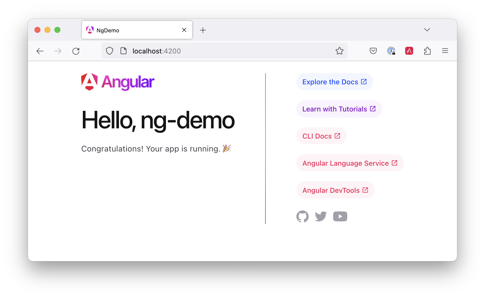
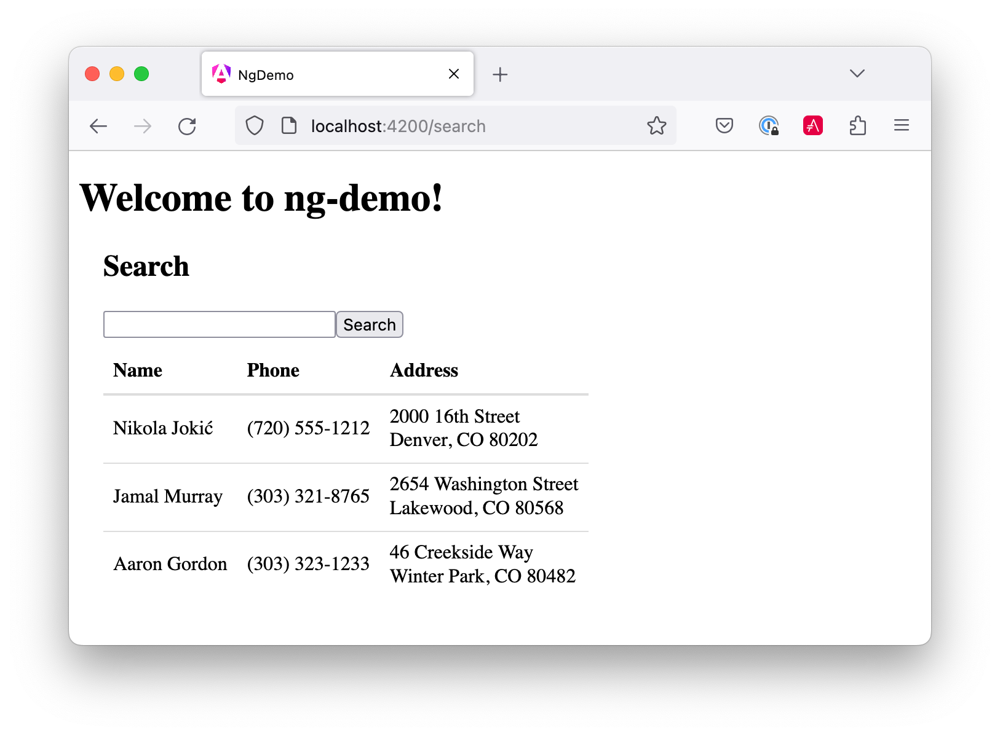

= Angular 2 and Angular CLI Demo

:author: Matt Raible
:email:  matt@raibledesigns.com
:revnumber: 1.1
:revdate:   {docdate}
:subject: Angular 2
:keywords: Angular 2, JavaScript, TypeScript, npm, gulp, Angular CLI
:doctype: book
:toc: macro
:icons: font
:lang: en
:language: javadocript
:sourcedir: .

This tutorial shows you how to build a simple search and edit application using https://angular.io[Angular 2] and
https://github.com/angular/angular-cli[Angular CLI].

.Source Code
****
If you'd like to get right to it, the https://github.com/mraible/ng2-demo[source is on GitHub]. To run the app,
use `ng serve`. To test it, run `ng test`. To run its integration tests, run `ng serve` in one terminal and
`ng e2e` in another.
****

toc::[]

== What you'll build

You'll build a simple web application with Angular CLI, a new tool for Angular 2 development. You'll create an
application with search and edit features.

== What you'll need

* About 15-30 minutes.
* A favorite text editor or IDE. I recommend https://www.jetbrains.com/idea/[IntelliJ IDEA] and its
https://plugins.jetbrains.com/plugin/8395?pr=idea[Angular 2 TypeScript Live Templates pluginplugin].
* https://github.com/angular/angular-cli[Angular CLI] installed.
* http://nodejs.org/[Node.js] and npm installed. I recommend using https://github.com/creationix/nvm[nvm].

== Create your project

If you don't have Angular CLI installed, install it using `npm install -g angular-cli@latest`. Create a new project
using the `ng new` command:

----
ng new ng2-demo
----

[NOTE]
====
Angular CLI requires Node 4 or greater. I used node v4.2.6 and npm 3.9.3 for this tutorial.
====

This will create a `ng-demo` project and run `npm install` in it. It takes about a minute to complete,
but will vary based on your internet connection speed.

----
$ ng new ng2-demo
installing ng2
  create .clang-format
  create .editorconfig
  create src/app/ng2-demo.component.css
  create src/app/ng2-demo.component.html
  create src/app/ng2-demo.component.spec.ts
  create src/app/ng2-demo.component.ts
  create src/app/environment.ts
  create src/app/index.ts
  create src/app/shared/index.ts
  create src/favicon.ico
  create src/index.html
  create src/main.ts
  create src/system-config.ts
  create src/tsconfig.json
  create src/typings.d.ts
  create angular-cli-build.js
  create angular-cli.json
  create config/environment.dev.ts
  create config/environment.js
  create config/environment.prod.ts
  create config/karma-test-shim.js
  create config/karma.conf.js
  create config/protractor.conf.js
  create e2e/app.e2e.ts
  create e2e/app.po.ts
  create e2e/tsconfig.json
  create e2e/typings.d.ts
  create .gitignore
  create package.json
  create public/.npmignore
  create tslint.json
  create typings.json
Successfully initialized git.
⠼ Installing packages for tooling via npm
├── es6-shim (ambient)
├── angular-protractor (ambient dev)
├── jasmine (ambient dev)
└── selenium-webdriver (ambient dev)

Installed packages for tooling via npm.
58s $
----

[TIP]
====
If you have the `tee` command installed, you can view this project's files using `tree -I "dist|node_modules|typings|tmp" .`.
====

== Run the application

The project is configured with a simple web server for development. To start it, run:

----
ng serve
----

You should see a screen like the one below at http://localhost:4200.

[[default-homepage]]
.Default homepage

You can make sure your new project's tests pass, run `ng test`:

----
$ ng test
Built project successfully. Stored in "dist/".

Build successful - 1131ms.

Slowest Trees                                 | Total
----------------------------------------------+---------------------
BroccoliTypeScriptCompiler                    | 685ms
vendor                                        | 255ms
HandlebarReplace                              | 141ms

Slowest Trees (cumulative)                    | Total (avg)
----------------------------------------------+---------------------
BroccoliTypeScriptCompiler (1)                | 685ms
vendor (1)                                    | 255ms
HandlebarReplace (1)                          | 141ms

12 06 2016 12:41:54.035:WARN [karma]: No captured browser, open http://localhost:9876/
12 06 2016 12:41:54.048:INFO [karma]: Karma v0.13.22 server started at http://localhost:9876/
12 06 2016 12:41:54.052:INFO [launcher]: Starting browser Chrome
12 06 2016 12:41:55.127:INFO [Chrome 51.0.2704 (Mac OS X 10.11.5)]: Connected on socket /#keU2x2a5Zf-zSJEDAAAA with id 28345914
Chrome 51.0.2704 (Mac OS X 10.11.5): Executed 4 of 4 SUCCESS (0.206 secs / 0.201 secs)
----

== Add a search feature

To add a search feature, open the project in an IDE or your favorite text editor. For IntelliJ IDEA, use
File > New Project > Static Web and point to the `ng2-demo` directory.

=== The Basics

In a terminal window, cd into your project's directory and run the following command. This will create a search
component and map its route.

[source]
----
$ ng g route search
installing route
installing component
  create src/app/+search/search.component.css
  create src/app/+search/search.component.html
  create src/app/+search/search.component.spec.ts
  create src/app/+search/search.component.ts
  create src/app/+search/index.ts
  create src/app/+search/shared/index.ts
----

To navigate to this component, add a link in `src/app/ng2-demo.component.html`.

[source,xml]
----
<a [routerLink]="['/search']">Search</a>
----

Open `src/app/+search/search.component.html` and replace its default HTML with the following:

[source,xml]
.src/client/app/+search/search.component.html
----
<h2>Search</h2>
<form>
  <input type="search" [(ngModel)]="query" (keyup.enter)="search()">
  <button type="button" (click)="search()">Search</button>
</form>
<pre>{{searchResults | json}}</pre>
----

In `src/app/+search/search.component.ts`, add imports for the core, form and router directives. Then
configure them as part of the component.

[source,js]
.src/app/+search/search.component.ts
----
import { CORE_DIRECTIVES, FORM_DIRECTIVES } from '@angular/common';
import { ROUTER_DIRECTIVES } from '@angular/router';

@Component({
  moduleId: module.id,
  selector: 'app-search',
  templateUrl: 'search.component.html',
  styleUrls: ['search.component.css'],
  directives: [FORM_DIRECTIVES, CORE_DIRECTIVES, ROUTER_DIRECTIVES]
})
----

[NOTE]
====
The file `src/app/+search/index.ts` exports `SearchComponent` and `Ng2DemoAppComponent`
(in `src/app/ng2-demo.component.ts`) imports it and maps its route. This happened when you ran Angular CLI's
`g route` command.
====

If you still have `ng serve` running, your browser should refresh automatically. If not, navigate to http://localhost:4200,
click on the "Search" link and you should see the search form.

[[search-component]]
.Search component
image::src/assets/images/search-without-css.png[Search component, 800, scaledwidth="100%"]

If you want to add CSS for this components, open `src/app/+search/search.component.css` and add some CSS. For example:

[source,css]
.src/app/+search/search.component.css
----
:host {
  display: block;
  padding: 0 20px;
}
----

[NOTE]
====
If you add CSS, you might notice there's no auto reload in your browser. This is a https://github.com/angular/angularcli/issues/815[known issue].
====

This section has shown you how to generate a new component to a basic Angular 2 application with Angular CLI.
The next section shows you how to create a use a JSON file and `localStorage` to create a fake API.

=== The Backend

To get search results, create a `SearchService` that makes HTTP requests to a JSON file. Start
by generating a new service.

----
ng g service search
---

Move the generated `search.service.ts` and its test to `app/shared/search`. You will likely need to create this directory.

Then, create `src/app/shared/search/data/people.json` to hold your data.

[source,json]
.src/app/shared/search/data/people.json
----
[
  {
    "id": 1,
    "name": "Peyton Manning",
    "phone": "(303) 567-8910",
    "address": {
      "street": "1234 Main Street",
      "city": "Greenwood Village",
      "state": "CO",
      "zip": "80111"
    }
  },
  {
    "id": 2,
    "name": "Demaryius Thomas",
    "phone": "(720) 213-9876",
    "address": {
      "street": "5555 Marion Street",
      "city": "Denver",
      "state": "CO",
      "zip": "80202"
    }
  },
  {
    "id": 3,
    "name": "Von Miller",
    "phone": "(917) 323-2333",
    "address": {
      "street": "14 Mountain Way",
      "city": "Vail",
      "state": "CO",
      "zip": "81657"
    }
  }
]
----

Modify `src/app/shared/search/search.service.ts` and provide `Http` as a dependency in its constructor.
In this same file, define the `Address` and `Person` classes that JSON will be marshalled to.

[source,javascript]
.src/app/shared/search/search.service.ts
----
import { Injectable } from '@angular/core';
import { Http, Response } from '@angular/http';

@Injectable()
export class SearchService {
  constructor(private http:Http) {}

  getAll() {
    return this.http.get('app/shared/search/data/people.json').map((res:Response) => res.json());
  }
}

export class Address {
  street:string;
  city:string;
  state:string;
  zip:string;

  constructor(obj?:any) {
    this.street = obj && obj.street || null;
    this.city = obj && obj.city || null;
    this.state = obj && obj.state || null;
    this.zip = obj && obj.zip || null;
  }
}

export class Person {
  id:number;
  name:string;
  phone:string;
  address:Address;

  constructor(obj?:any) {
    this.id = obj && Number(obj.id) || null;
    this.name = obj && obj.name || null;
    this.phone = obj && obj.phone || null;
    this.address = obj && obj.address || null;
  }
}
----

In `search.component.ts`, add imports for these classes.

[source,javascript]
.src/app/+search/search.component.ts
----
import { Person, SearchService } from '../shared/index';
----

You can now add `query` and `searchResults` variables. While you're there, modify the constructor to inject the `SearchService`.

[source,javascript]
.src/client/app/+search/search.component.ts
----
export class SearchComponent implements OnInit {
  query:string;
  searchResults: Array<Person>;

  constructor(public searchService: SearchService) {}
----

Then implement the `search()` method to call the service's `getAll()` method.

[source,javascript]
.src/app/+search/search.component.ts
----
search(): void {
  this.searchService.getAll().subscribe(
    data => {this.searchResults = data;},
    error => console.log(error)
  );
}
----

At this point, you'll likely see the following message in your browser's console.

----
ORIGINAL EXCEPTION: No provider for SearchService!
----

This happens because the app hasn't provided this service to components. To fix this, modify
`src/app/shared/search/index.ts` to export the `SearchService`.

[source,javascript]
.src/app/shared/search/index.ts
----
export * from './search/search.service';
----

To fix the "No provider" error from above, update `ng2-demo.component.ts` to import the `SearchService`
and add the service to the list of providers.

[source,javascript]
.src/app/ng2-demo.component.ts
----
import { SearchService } from './shared/index';

@Component({
  ...
  providers: [HTTP_PROVIDERS, ROUTER_PROVIDERS],
  viewProviders: [SearchService]
})
----

Now clicking the search button should work. To make the results look better,
remove the `<pre>` tag and replace it with a `<table>`.

[source,xml]
.src/app/+search/search.component.html
----
<table *ngIf="searchResults">
  <thead>
  <tr>
    <th>Name</th>
    <th>Phone</th>
    <th>Address</th>
  </tr>
  </thead>
  <tbody>
  <tr *ngFor="let person of searchResults; let i=index">
    <td>{{person.name}}</td>
    <td>{{person.phone}}</td>
    <td>{{person.address.street}} 
      {{person.address.city}}, {{person.address.state}} {{person.address.zip}}
    </td>
  </tr>
  </tbody>
</table>
----

Then add some additional CSS to improve its table layout.

[source,css]
.src/app/+search/search.component.css
----
table {
  margin-top: 10px;
  border-collapse: collapse;
}

th {
  text-align: left;
  border-bottom: 2px solid #ddd;
  padding: 8px;
}

td {
  border-top: 1px solid #ddd;
  padding: 8px;
}
----

Now the search results look better.

[[search-results]]
.Search results

But wait, we still don't have search functionality! To add a search feature, add a `search()` method to `SearchService`.

[source,javascript]
.src/app/shared/search/search.service.ts
----
search(q:string) {
  if (!q || q === '*') {
    q = '';
  } else {
    q = q.toLowerCase();
  }
  return this.getAll().map(data => {
    let results:any = [];
    data.map(item => {
      if (JSON.stringify(item).toLowerCase().includes(q)) {
        results.push(item);
      }
    });
    return results;
  });
}
----

Then refactor `SearchComponent` to call this method with its `query` variable.

[source,javascript]
.src/app/+search/search.component.ts
----
search(): void {
  this.searchService.search(this.query).subscribe(
    data => {this.searchResults = data;},
    error => console.log(error)
  );
}
----

Now search results will be filtered by the query value you type in.

This section showed you how to fetch and display search results. The next section builds on this and shows how to edit and save a record.

== Add an edit feature

Modify `search.component.html` to add a link for editing a person.

[source,html]
.src/app/+search/search.component.html
----
<td><a [routerLink]="['/edit', person.id]">{{person.name}}</a></td>
----

Run the following command to generate an `EditComponent` and an associated route.

[source]
----
$ ng g route edit
installing route
installing component
  create src/app/+edit/edit.component.css
  create src/app/+edit/edit.component.html
  create src/app/+edit/edit.component.spec.ts
  create src/app/+edit/edit.component.ts
  create src/app/+edit/index.ts
  create src/app/+edit/shared/index.ts
----

Update `src/app/+edit/edit.component.html` to display an editable form. You might notice I've added `id` attributes to most elements. This is to
make things easier when writing integration tests with Protractor.

[source,html]
.src/app/+edit/edit.component.html
----

  <h3>{{editName}}</h3>
  

    <label>Id:</label>
    {{person.id}}
  

  

    <label>Name:</label>
    <input [(ngModel)]="editName" id="name" placeholder="name"/>
  

  

    <label>Phone:</label>
    <input [(ngModel)]="editPhone" id="phone" placeholder="Phone"/>
  

  <fieldset>
    <legend>Address:</legend>
    <address>
      <input [(ngModel)]="editAddress.street" id="street"> 
      <input [(ngModel)]="editAddress.city" id="city">,
      <input [(ngModel)]="editAddress.state" id="state" size="2">
      <input [(ngModel)]="editAddress.zip" id="zip" size="5">
    </address>
  </fieldset>
  <button (click)="save()" id="save">Save</button>
  <button (click)="cancel()" id="cancel">Cancel</button>

----

Modify `EditComponent` to import model and service claases and to use the `SearchService` to get data.

[source,javascript]
.src/app/+edit/edit.component.ts
----
import { Component, OnInit } from '@angular/core';
import { Person, Address, SearchService } from '../shared/index';
import { RouteSegment, Router } from '@angular/router';

@Component({
  selector: 'sd-edit',
  moduleId: module.id,
  templateUrl: 'edit.component.html',
  styleUrls: ['edit.component.css']
})
export class EditComponent implements OnInit {

  person: Person;
  editName: string;
  editPhone: string;
  editAddress: Address;

  constructor(
    private _service: SearchService,
    private _router: Router,
    private _routeSegment: RouteSegment
  ) { }

  ngOnInit() {
    let id = +this._routeSegment.getParam('id');
    this._service.get(id).subscribe(person => {
      if (person) {
        this.editName = person.name;
        this.editPhone = person.phone;
        this.editAddress = person.address;
        this.person = person;
      } else {
        this.gotoList();
      }
    });
  }

  cancel() {
    this._router.navigate(['/search']);
  }

  save() {
    this.person.name = this.editName;
    this.person.phone = this.editPhone;
    this.person.address = this.editAddress;
    this._service.save(this.person);
    this.gotoList();
  }

  gotoList() {
    if (this.person) {
      this._router.navigate(['/search', {term: this.person.name} ]);
    } else {
      this._router.navigate(['/search']);
    }
  }
}
----

Modify `SearchService` to contain functions for finding a person by their id, and saving them. While you're in there, modify the `search()` method to
be aware of updated objects in `localStorage`.

[source,javascript]
.src/app/shared/search/search.service.ts
----
search(q:string) {
  if (!q || q === '*') {
    q = '';
  } else {
    q = q.toLowerCase();
  }
  return this.getAll().map(data => {
    let results:any = [];
    data.map(item => {
      // check for item in localStorage
      if (localStorage['person' + item.id]) {
        item = JSON.parse(localStorage['person' + item.id]);
      }
      if (JSON.stringify(item).toLowerCase().includes(q)) {
        results.push(item);
      }
    });
    return results;
  });
}

get(id: number) {
  return this.getAll().map(all => {
    if (localStorage['person' + id]) {
      return JSON.parse(localStorage['person' + id]);
    }
    return all.find(e => e.id === id);
  });
}

save(person: Person) {
  localStorage['person' + person.id] = JSON.stringify(person);
}
----

You can add CSS to `src/app/+edit/edit.component.css` if you want to make the form look a bit better.

[source,css]
.src/app/+edit/edit.component.css
----
:host {
  display: block;
  padding: 0 16px;
}

button {
  margin-top: 10px;
}
----

At this point, you should be able to search for a person and update their information.

[[edit-form]]
.Edit component
image::src/assets/images/edit-form.png[Edit form, 800, scaledwidth="100%"]

The &lt;form> in `src/app/+edit/edit.component.html` calls a `save()` function to update a person's data. You already implemented this above.
The function calls a `gotoList()` function that appends the person's name to the URL when sending the user back to the search screen.

[source,javascript]
.src/app/+edit/edit.component.ts
----
gotoList() {
  if (this.person) {
    this._router.navigate(['/search', {term: this.person.name} ]);
  } else {
    this._router.navigate(['/search']);
  }
}
----

Since the `SearchComponent` doesn't execute a search automatically when you execute this URL, add the following logic to do so in its constructor.

[source,javascript]
.src/app/+search/search.component.ts
----
constructor(public searchService: SearchService, routeSegment: RouteSegment) {
  if (routeSegment.getParam('term')) {
    this.query = decodeURIComponent(routeSegment.getParam('term'));
    this.search();
  }
}
----

You'll need to import `RouteSegment` in order for everything to compile.

[source,javascript]
.src/app/+search/search.component.ts
----
import { ROUTER_DIRECTIVES, RouteSegment } from '@angular/router';
----

After making all these changes, you should be able to search/edit/update a person's information. If it works - nice job!

== Source code

A completed project with this code in it is available on GitHub at https://github.com/mraible/ng2-demo.

== Summary

I hope you've enjoyed this quick-and-easy tutorial on how to get started with Angular 2 and Angular CLI. In a future tutorial,
I'll show you how to write unit tests and integration tests for this application.
