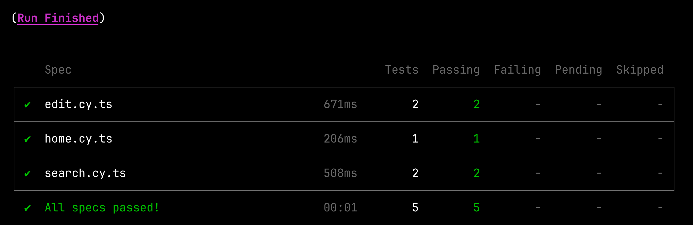

= &#x1F9B4; Bare Bones Angular and Angular CLI Tutorial

:author: Matt Raible
:email:  matt@raibledesigns.com
:revnumber: 15.1
:revdate: {docdate}
:subject: Angular and Angular CLI
:keywords: Angular, Angular CLI, TypeScript, JavaScript, Node, npm, Jasmine, Protractor
:icons: font
:lang: en
:language: javadocript
:sourcedir: .
ifndef::env-github[]
:icons: font
endif::[]
ifdef::env-github,env-browser[]
:toc: preamble
:toclevels: 2
endif::[]
ifdef::env-github[]
:status:
:outfilesuffix: .adoc
:!toc-title:
:caution-caption: :fire:
:important-caption: :exclamation:
:note-caption: :paperclip:
:tip-caption: :bulb:
:warning-caption: :warning:
endif::[]
:toc: macro
:source-highlighter: highlight.js

IMPORTANT: For a book of this tutorial, please check out https://www.infoq.com/minibooks/angular-mini-book/[The Angular Mini-Book]. Its "Build an Angular App" chapter was inspired by this tutorial.

This tutorial shows you how to build a bare-bones search and edit application using https://angular.io[Angular] and
https://github.com/angular/angular-cli[Angular CLI] version 15.

toc::[]

// For older versions of Angular, please see previous tutorials: https://github.com/mraible/ng-demo/blob/0dd604537e18b3ccf1f707d45af54b418a574954/README.adoc[Angular 10], https://github.com/mraible/ng-demo/blob/bec5fdf3b3da0419b012971ab42870df03ce94ea/README.adoc[Angular 9], https://github.com/mraible/ng-demo/blob/6a24488ca847dea215ad70101a22f3ebf67ba79a/README.adoc[Angular 7], https://github.com/mraible/ng-demo/blob/41d9526dbc0a35131118f7f101938dfe75a0e212/README.adoc[Angular 6], and https://github.com/mraible/ng-demo/blob/662159470802c53f445db6393576c0926e31d642/README.adoc[Angular 5].

ifdef::env-github[]
TIP: It appears you're reading this document on GitHub. If you want a prettier view, install https://chrome.google.com/webstore/detail/asciidoctorjs-live-previe/iaalpfgpbocpdfblpnhhgllgbdbchmia[Asciidoctor.js Live Preview for Chrome], then view the https://raw.githubusercontent.com/mraible/ng-demo/main/README.adoc?toc=left[raw document]. Another option is to use the https://gist.asciidoctor.org/?github-mraible%2Fng-demo%2Fmain%2F%2FREADME.adoc[DocGist view].
endif::[]

.Source Code
****
If you'd like to get right to it, the https://github.com/mraible/ng-demo[source is on GitHub]. To run the app, use `ng serve`. To test it, run `ng test`. To run its integration tests, run `ng e2e`.
****

toc::[]

== What you'll build

You'll build a simple web application with Angular CLI, a tool for Angular development. You'll create an application with search and edit features.

== What you'll need

* About 30 minutes.
* A favorite text editor or IDE. I recommend https://www.jetbrains.com/idea/[IntelliJ IDEA].
* http://nodejs.org/[Node.js] and npm installed.
* https://github.com/angular/angular-cli[Angular CLI] installed.

If you don't have Angular CLI installed, install it:

----
npm install -g @angular/cli@15
----

NOTE: IntelliJ IDEA Ultimate Edition has the best support for TypeScript. If you'd rather not pay for your IDE, checkout https://code.visualstudio.com/[Visual Studio Code].

== Create a new Angular project

Create a new project using the `ng new` command:

----
ng new ng-demo
----

When prompted to install Angular routing, type "`Y`". For the stylesheet format, choose "`CSS`" (the default).

This will create a `ng-demo` project and run `npm install` in it. It takes about a minute to complete, but will vary based on your internet connection speed.

You can see the version of Angular CLI you're using with the `ng version` command.

----
$ ng version

     _                      _                 ____ _     ___
    / \   _ __   __ _ _   _| | __ _ _ __     / ___| |   |_ _|
   / △ \ | '_ \ / _` | | | | |/ _` | '__|   | |   | |    | |
  / ___ \| | | | (_| | |_| | | (_| | |      | |___| |___ | |
 /_/   \_\_| |_|\__, |\__,_|_|\__,_|_|       \____|_____|___|
                |___/

Angular CLI: 15.1.3
Node: 18.13.0
Package Manager: npm 8.19.3
OS: darwin arm64

Angular:
...

Package                      Version
------------------------------------------------------
@angular-devkit/architect    0.1501.3 (cli-only)
@angular-devkit/core         15.1.3 (cli-only)
@angular-devkit/schematics   15.1.3 (cli-only)
@schematics/angular          15.1.3 (cli-only)
----

If you run this command from the `ng-demo` directory, you'll see even more information.

----
....

Angular: 15.1.2
... animations, common, compiler, compiler-cli, core, forms
... platform-browser, platform-browser-dynamic, router

Package                         Version
---------------------------------------------------------
@angular-devkit/architect       0.1501.3
@angular-devkit/build-angular   15.1.3
@angular-devkit/core            15.1.3
@angular-devkit/schematics      15.1.3
@angular/cli                    15.1.3
@schematics/angular             15.1.3
rxjs                            7.8.0
typescript                      4.9.4
----

== Run the application

The project is configured with a simple web server for development. To start it, run:

----
ng serve
----

You should see a screen like the one below at http://localhost:4200.

[[default-homepage]]
.Default homepage
image::src/assets/images/default-homepage.png[Default Homepage, 800, scaledwidth="100%"]

You can make sure your new project's tests pass, run `ng test`:

----
$ ng test
...
...: Executed 3 of 3 SUCCESS (0.061 secs / 0.055 secs)
----

== Add a search feature

To add a search feature, open the project in an IDE or your favorite text editor.

=== The Basics

In a terminal window, cd into your project's directory and run the following command to create a search component.

[source]
----
ng g component search
----

Open `src/app/search/search.component.html` and replace its default HTML with the following:

[source,html]
.src/app/search/search.component.html
----
<h2>Search</h2>
<form>
  <input type="search" name="query" [(ngModel)]="query" (keyup.enter)="search()">
  <button type="button" (click)="search()">Search</button>
</form>
<pre>{{searchResults | json}}</pre>
----

Add a `query` property to `src/app/search/search.component.ts`. While you're there, add a `searchResults` property and an empty `search()` method.

[source,typescript]
.src/app/search/search.component.ts
----
export class SearchComponent implements OnInit {
  query: string = '';
  searchResults: any;

  constructor() { }

  ngOnInit(): void { }

  search(): void { }

}
----

In `src/app/app-routing.module.ts`, modify the `routes` constant to add `SearchComponent` as the default:

[source,typescript]
.src/app/app-routing.module.ts
----
import { SearchComponent } from './search/search.component';

const routes: Routes = [
  { path: 'search', component: SearchComponent },
  { path: '', redirectTo: '/search', pathMatch: 'full' }
];
----

Run `ng serve` again you will see a compilation error.

----
ERROR in src/app/search/search.component.html:3:37 - error NG8002:
 Can't bind to 'ngModel' since it isn't a known property of 'input'.
----

To solve this, open `src/app/app.module.ts` and add `FormsModule` as an import in `@NgModule`:

[source,typescript]
.src/app/app.module.ts
----
import { FormsModule } from '@angular/forms';

@NgModule({
  ...
  imports: [
    ...
    FormsModule
  ]
  ...
})
export class AppModule { }
----

Now you should be able to see the search form.

[[search-component]]
.Search component
image::src/assets/images/search-without-css.png[Search component, 800, scaledwidth="100%"]

If yours looks different, it's because I trimmed my `app.component.html` to the bare minimum.

[source,html]
.src/app/app.component.html
----
<h1>Welcome to {{ title }}!</h1>

<router-outlet></router-outlet>
----

If you want to add styling for this component, open `src/app/search/search.component.css` and add some CSS. For example:

[source,css]
.src/app/search/search.component.css
----
:host {
  display: block;
  padding: 0 20px;
}
----

IMPORTANT: The `:host` allows you to target the container of the component. It's the only way to target the host element. You can't reach the host element from inside the component with other selectors because it's not part of the component's own template.

This section has shown you how to generate a new component and add it to a basic Angular application with Angular CLI. The next section shows you how to create and use a JSON file and `localStorage` to create a fake API.

=== The Backend

To get search results, create a `SearchService` that makes HTTP requests to a JSON file. Start by generating a new service.

----
ng g service shared/search/search
----

Create `src/assets/data/people.json` to hold your data.

----
mkdir -p src/assets/data
----

[source,json]
.src/assets/data/people.json
----
[
  {
    "id": 1,
    "name": "Nikola Jokić",
    "phone": "(720) 555-1212",
    "address": {
      "street": "2000 16th Street",
      "city": "Denver",
      "state": "CO",
      "zip": "80202"
    }
  },
  {
    "id": 2,
    "name": "Jamal Murray",
    "phone": "(303) 321-8765",
    "address": {
      "street": "2654 Washington Street",
      "city": "Lakewood",
      "state": "CO",
      "zip": "80568"
    }
  },
  {
    "id": 3,
    "name": "Aaron Gordon",
    "phone": "(303) 323-1233",
    "address": {
      "street": "46 Creekside Way",
      "city": "Winter Park",
      "state": "CO",
      "zip": "80482"
    }
  }
]
----

Modify `src/app/shared/search/search.service.ts` and provide `HttpClient` as a dependency in its constructor.

In this same file, create a `getAll()` method to gather all the people. Also, define the `Address` and `Person` classes that JSON will be marshalled to.

[source,typescript]
.src/app/shared/search/search.service.ts
----
import { Injectable } from '@angular/core';
import { HttpClient } from '@angular/common/http';
import { Observable } from 'rxjs';

@Injectable({
  providedIn: 'root'
})
export class SearchService {

  constructor(private http: HttpClient) { }

  getAll(): Observable<Person[]> {
    return this.http.get<Person[]>('assets/data/people.json');
  }
}

export class Address {
  street: string;
  city: string;
  state: string;
  zip: string;

  constructor(obj?: any) {
    this.street = obj?.street || null;
    this.city = obj?.city || null;
    this.state = obj?.state || null;
    this.zip = obj?.zip || null;
  }
}

export class Person {
  id: number;
  name: string;
  phone: string;
  address: Address;

  constructor(obj?: any) {
    this.id = obj?.id || null;
    this.name = obj?.name || null;
    this.phone = obj?.phone || null;
    this.address = obj?.address || null;
  }
}
----

To make these classes easier to consume by your components, create `src/app/shared/index.ts` and add the following:

[source,typescript]
.src/app/shared/index.ts
----
export * from './search/search.service';
----

The reason for creating this file is so you can import multiple classes on a single line rather than having to import each individual class on separate lines.

In `search.component.ts`, add imports for these classes.

[source,typescript]
.src/app/search/search.component.ts
----
import { Person, SearchService } from '../shared';
----

You can now add a proper type to the `searchResults` variable. While you're there, modify the constructor to inject the `SearchService`.

[source,typescript]
.src/app/search/search.component.ts
----
export class SearchComponent implements OnInit {
  query: string = '';
  searchResults: Person[] = [];

  constructor(private searchService: SearchService) { }
----

Then update the `search()` method to call the service's `getAll()` method.

[source,typescript]
.src/app/search/search.component.ts
----
search(): void {
  this.searchService.getAll().subscribe({
    next: (data: any) => {
      this.searchResults = data;
    },
    error: error => console.log(error)
  });
}
----

At this point, if your app is running, you'll see the following message in your browser's console.

----
NullInjectorError: No provider for HttpClient!
----

To fix the "`No provider`" error from above, update `app.module.ts` to import `HttpClientModule`.

[source,typescript]
.src/app/app.module.ts
----
import { HttpClientModule } from '@angular/common/http';

@NgModule({
  ...
  imports: [
    ...
    HttpClientModule
  ],
  providers: [],
  bootstrap: [AppComponent]
})
----

Now clicking the search button should work. To make the results look better, remove the `<pre>` tag and replace it with a `<table>` in `search.component.html`.

[source,xml]
.src/app/search/search.component.html
----
<table *ngIf="searchResults?.length">
  <thead>
  <tr>
    <th>Name</th>
    <th>Phone</th>
    <th>Address</th>
  </tr>
  </thead>
  <tbody>
  <tr *ngFor="let person of searchResults; let i=index">
    <td>{{person.name}}</td>
    <td>{{person.phone}}</td>
    <td>{{person.address.street}} 
      {{person.address.city}}, {{person.address.state}} {{person.address.zip}}
    </td>
  </tr>
  </tbody>
</table>
----

Then add some additional CSS to `search.component.css` to improve its table layout.

[source,css]
.src/app/search/search.component.css
----
table {
  margin-top: 10px;
  border-collapse: collapse;
}

th {
  text-align: left;
  border-bottom: 2px solid #ddd;
  padding: 8px;
}

td {
  border-top: 1px solid #ddd;
  padding: 8px;
}
----

Now the search results look better.

[[search-results]]
.Search results
image::src/assets/images/search-results.png[Search Results, 800, scaledwidth="100%"]

But wait, you still don't have search functionality! To add a search feature, add a `search()` method to `SearchService`.

[source,typescript]
.src/app/shared/search/search.service.ts
----
import { map, Observable } from 'rxjs';
...

  search(q: string): Observable<Person[]> {
    if (!q || q === '*') {
      q = '';
    } else {
      q = q.toLowerCase();
    }
    return this.getAll().pipe(
      map((data: Person[]) => data
        .filter((item: Person) => JSON.stringify(item).toLowerCase().includes(q)))
    );
  }
----

Then refactor `SearchComponent` to call this method with its `query` variable.

[source,typescript]
.src/app/search/search.component.ts
----
search(): void {
  this.searchService.search(this.query).subscribe({
    next: (data: Person[]) => {
      this.searchResults = data;
    },
    error: error => console.log(error)
  });
}
----

Now search results will be filtered by the query value you type in.

This section showed you how to fetch and display search results. The next section builds on this and shows how to edit and save a record.

== Add an edit feature

Modify `search.component.html` to wrap the person's name with a link.

[source,html]
.src/app/search/search.component.html
----
<td><a [routerLink]="['/edit', person.id]">{{person.name}}</a></td>
----

Run the following command to generate an `EditComponent`.

[source]
----
ng g component edit
----

Add a route for this component in `app-routing.module.ts`:

[source,typescript]
.src/app/app-routing.module.ts
----
import { EditComponent } from './edit/edit.component';

const routes: Routes = [
  { path: 'search', component: SearchComponent },
  { path: 'edit/:id', component: EditComponent },
  { path: '', redirectTo: '/search', pathMatch: 'full' }
];
----

Update `src/app/edit/edit.component.html` to display an editable form. You might notice I've added `id` attributes to most elements. This is to make it easier to locate elements when writing integration tests.

[source,html]
.src/app/edit/edit.component.html
----

  <h3>{{person.name}}</h3>
  

    <label>Id:</label>
    {{person.id}}
  

  

    <label>Name:</label>
    <input [(ngModel)]="person.name" name="name" id="name" placeholder="name"/>
  

  

    <label>Phone:</label>
    <input [(ngModel)]="person.phone" name="phone" id="phone" placeholder="Phone"/>
  

  <fieldset>
    <legend>Address:</legend>
    <address>
      <input [(ngModel)]="person.address.street" id="street"> 
      <input [(ngModel)]="person.address.city" id="city">,
      <input [(ngModel)]="person.address.state" id="state" size="2">
      <input [(ngModel)]="person.address.zip" id="zip" size="5">
    </address>
  </fieldset>
  <button (click)="save()" id="save">Save</button>
  <button (click)="cancel()" id="cancel">Cancel</button>

----

Modify `EditComponent` to import model and service classes and to use the `SearchService` to get data.

[source,typescript]
.src/app/edit/edit.component.ts
----
import { Component, OnInit, OnDestroy } from '@angular/core';
import { Person, SearchService } from '../shared';
import { Subscription } from 'rxjs';
import { ActivatedRoute, Router } from '@angular/router';

@Component({
  selector: 'app-edit',
  templateUrl: './edit.component.html',
  styleUrls: ['./edit.component.css']
})
export class EditComponent implements OnInit, OnDestroy {
  person!: Person;
  sub!: Subscription;

  constructor(private route: ActivatedRoute,
              private router: Router,
              private service: SearchService) {
  }

  async ngOnInit(): Promise<void> {
    this.sub = this.route.params.subscribe(params => {
      const id = +params['id']; // (+) converts string 'id' to a number
      this.service.get(id).subscribe(person => {
        if (person) {
          this.person = person;
        } else {
          this.gotoList();
        }
      });
    });
  }

  ngOnDestroy(): void {
    if (this.sub) {
      this.sub.unsubscribe();
    }
  }

  async cancel() {
    await this.router.navigate(['/search']);
  }

  async save() {
    this.service.save(this.person);
    await this.gotoList();
  }

  async gotoList() {
    if (this.person) {
      await this.router.navigate(['/search', {term: this.person.name} ]);
    } else {
      await this.router.navigate(['/search']);
    }
  }
}
----

Modify `SearchService` to contain functions for finding a person by their id and saving them. While you're in there, modify the `search()` method to be aware of updated objects in `localStorage`.

[source,typescript]
.src/app/shared/search/search.service.ts
----
search(q: string): Observable<Person[]> {
  if (!q || q === '*') {
    q = '';
  } else {
    q = q.toLowerCase();
  }
  return this.getAll().pipe(
    map((data: Person[]) => data
      .map((item: Person) => !!localStorage['person' + item.id] ?
        JSON.parse(localStorage['person' + item.id]) : item)
      .filter((item: Person) => JSON.stringify(item).toLowerCase().includes(q))
    ));
}

get(id: number): Observable<Person> {
  return this.getAll().pipe(map((all: Person[]) => {
    if (localStorage['person' + id]) {
      return JSON.parse(localStorage['person' + id]);
    }
    return all.find((e: Person) => e.id === id);
  }));
}

save(person: Person) {
  localStorage['person' + person.id] = JSON.stringify(person);
}
----

You can add CSS to `src/app/edit/edit.component.css` if you want to make the form look a bit better.

[source,css]
.src/app/edit/edit.component.css
----
:host {
  display: block;
  padding: 0 20px;
}

button {
  margin-top: 10px;
}
----

At this point, you should be able to search for a person and update their information.

[[edit-form]]
.Edit component
image::src/assets/images/edit-form.png[Edit form, 800, scaledwidth="100%"]

The &lt;form> in `src/app/edit/edit.component.html` calls a `save()` function to update a person's data. You already implemented this above.
The function calls a `gotoList()` function that appends the person's name to the URL when sending the user back to the search screen.

[source,typescript]
.src/app/edit/edit.component.ts
----
gotoList() {
  if (this.person) {
    this.router.navigate(['/search', {term: this.person.name} ]);
  } else {
    this.router.navigate(['/search']);
  }
}
----

Since the `SearchComponent` doesn't execute a search automatically when you execute this URL, add the following logic to do so in its `ngOnInit()` method.

[source,typescript]
.src/app/search/search.component.ts
----
import { ActivatedRoute } from '@angular/router';
import { Subscription } from 'rxjs';
...

  sub!: Subscription;

  constructor(private searchService: SearchService, private route: ActivatedRoute) { }

  ngOnInit(): void {
    this.sub = this.route.params.subscribe(params => {
      if (params['term']) {
        this.query = decodeURIComponent(params['term']);
        this.search();
      }
    });
  }
----

You'll want to implement `OnDestroy` and define the `ngOnDestroy` method to clean up this subscription.

[source,typescript]
.src/app/search/search.component.ts
----
import { Component, OnDestroy, OnInit } from '@angular/core';

export class SearchComponent implements OnInit, OnDestroy {
  ...

  ngOnDestroy(): void {
    if (this.sub) {
      this.sub.unsubscribe();
    }
  }
}
----

After making all these changes, you should be able to search/edit/update a person's information. If it works - nice job!

=== Form Validation

One thing you might notice is you can clear any input element in the form and save it. At the very least, the `name` field should be required. Otherwise, there's nothing to click on in the search results.

To make name required, modify `edit.component.html` to add a `required` attribute to the name `<input>` and bind it to Angular's validation with `#name="ngModel"`. Add a `
` next to the field to display an error message when validation fails.

[source,html]
.src/app/edit/edit.component.html
----
<input [(ngModel)]="person.name" name="name" id="name" placeholder="name" required #name="ngModel"/>

  Name is required

----

You'll also need to wrap everything in a `<form>` element. Add `<form>` after the `<h3>` tag and close it before the last `
`. You'll also need to add an `(ngSubmit)` handler to the form, give it the name of `editForm`, and change the save button to be a regular submit button that's disabled when the form is invalid.

[source,html]
.src/app/edit/edit.component.html
----
<h3>{{person.name}}</h3>
<form (ngSubmit)="save()" #editForm="ngForm">
  ...
  <button type="submit" id="save" [disabled]="!editForm.form.valid">Save</button>
  <button (click)="cancel()" id="cancel">Cancel</button>
</form>
----

After making these changes, the name field will be required.

[[edit-form-required]]
.Edit form with validation
image::src/assets/images/edit-form-validation.png[Edit form with validation, 800, scaledwidth="100%"]

In this screenshot, you might notice the address fields are blank and the save button is enabled. This is explained by the error in your console.

----
If ngModel is used within a form tag, either the name attribute must be set or the form control must be defined as 'standalone' in ngModelOptions.

Example 1: <input [(ngModel)]="person.firstName" name="first">
Example 2: <input [(ngModel)]="person.firstName" [ngModelOptions]="{standalone: true}">
----

To fix this, add a `name` attribute to all the address fields. For example:

[source,html]
.src/app/edit/edit.component.html
----
<address>
  <input [(ngModel)]="person.address.street" name="street" id="street"> 
  <input [(ngModel)]="person.address.city" name="city" id="city">,
  <input [(ngModel)]="person.address.state" name="state" id="state" size="2">
  <input [(ngModel)]="person.address.zip" name="zip" id="zip" size="5">
</address>
----

Now values display in all fields, `name` is required, and save is disabled when the form is invalid.

[[edit-form-names]]
.Edit form with names and validation
image::src/assets/images/edit-form-names.png[Edit form with names and validation, 800, scaledwidth="100%"]

To learn more about forms and validation, see https://angular.io/guide/form-validation[Angular's Validating form input documentation].

== Unit and End-to-End Testing

Now that you've built an application, it's important to test it to ensure it works. The best reason for writing tests is to automate your testing. Without tests, you'll likely be testing manually. This manual testing will take longer and longer as your application grows.

In this section, you'll learn to use http://jasmine.github.io/[Jasmine] for unit testing controllers and https://www.cypress.io/[Cypress] for integration testing.

=== Fix the Tests

If you run `ng test`, you'll likely get failures for the components and service you created. These failures will be solved as you complete the section below. The `ng test` command will start a process that listens for changes so all you need to do is edit/save files and tests will be automatically run again.

TIP: You can use `x` and `f` prefixes in front of `describe` and `it` functions to _exclude_ or _only_ run a particular test.

=== Fix the `AppComponent` test

If you changed the `app.component.html` template as I did, you'll need to modify `app.component.spec.ts` to account for the change in HTML. Change its last test to look for an `<h1>` element and the welcome message inside it.

[source,ts]
.src/app/app.component.spec.ts
----
it('should render title', () => {
  const fixture = TestBed.createComponent(AppComponent);
  fixture.detectChanges();
  const compiled = fixture.nativeElement as HTMLElement;
  expect(compiled.querySelector('h1')?.textContent).toContain('Welcome to ng-demo!');
});
----

Now this test should pass.

=== Unit test the SearchService

Modify `src/app/shared/search/search.service.spec.ts` and set up the test's infrastructure (a.k.a. `TestBed`) using `HttpClientTestingModule` and `HttpTestingController`.

[source,typescript]
.src/app/shared/search/search.service.spec.ts
----
import { TestBed } from '@angular/core/testing';
import { SearchService } from './search.service';
import { HttpClientTestingModule, HttpTestingController } from '@angular/common/http/testing';

describe('SearchService', () => {
  let service: SearchService;
  let httpMock: HttpTestingController;

  beforeEach(async () => {
    await TestBed.configureTestingModule({
      imports: [HttpClientTestingModule],
      providers: [SearchService]
    });

    service = TestBed.inject(SearchService);
    httpMock = TestBed.inject(HttpTestingController);
  });

  it('should be created', () => {
    expect(service).toBeTruthy();
  });
});
----

Now, you will likely see some errors about the test stubs that Angular CLI created for you. You can ignore these for now.

[%autofit]
----
NullInjectorError: R3InjectorError(DynamicTestModule)[SearchService -> HttpClient -> HttpClient]:
  NullInjectorError: No provider for HttpClient!

NullInjectorError: R3InjectorError(DynamicTestModule)[ActivatedRoute -> ActivatedRoute]:
  NullInjectorError: No provider for ActivatedRoute!
----

`HttpTestingController` allows you to mock requests and use its `flush()` method to provide response values. Since the HTTP request methods return an `Observable`, you can subscribe to it and create expectations in the callback methods. Add the first test of `getAll()` to `search.service.spec.ts`.

The test below should be on the same level as `beforeEach`.

[source,typescript]
.src/app/shared/search/search.service.spec.ts
----
it('should retrieve all search results', () => {
  const mockResponse = [
    {name: 'Nikola Jokić'},
    {name: 'Mike Malone'}
  ];

  service.getAll().subscribe((people: any) => {
    expect(people.length).toBe(2);
    expect(people[0].name).toBe('Nikola Jokić');
    expect(people).toEqual(mockResponse);
  });

  const req = httpMock.expectOne('assets/data/people.json');
  expect(req.request.method).toBe('GET');
  req.flush(mockResponse);
});
----

While you're there, add an `afterEach()` to verify requests.

[source,typescript]
.src/app/shared/search/search.service.spec.ts
----
afterEach(() => {
  httpMock.verify();
});
----

Add a couple more tests for filtering by search term and fetching by id.

[source,typescript]
.src/app/shared/search/search.service.spec.ts
----
it('should filter by search term', () => {
  const mockResponse = [{name: 'Nikola Jokić'}];

  service.search('nik').subscribe((people: any) => {
    expect(people.length).toBe(1);
    expect(people[0].name).toBe('Nikola Jokić');
  });

  const req = httpMock.expectOne('assets/data/people.json');
  expect(req.request.method).toBe('GET');
  req.flush(mockResponse);
});

it('should fetch by id', () => {
  const mockResponse = [
    {id: 1, name: 'Nikola Jokić'},
    {id: 2, name: 'Mike Malone'}
  ];

  service.get(2).subscribe((person: any) => {
    expect(person.name).toBe('Mike Malone');
  });

  const req = httpMock.expectOne('assets/data/people.json');
  expect(req.request.method).toBe('GET');
  req.flush(mockResponse);
});
----

=== Unit test the SearchComponent

To unit test the `SearchComponent`, you can mock the methods in `SearchService` with http://angular-tips.com/blog/2021/07/unit-testing-spies-and-mocks/[spies]. These allow you to _spy_ on functions to check if they were called.

Create `src/app/shared/search/mocks/routes.ts` to mock Angular's `Router` and `ActivatedRoute`.

[source,typescript]
.src/app/shared/search/mocks/routes.ts
----
import { ActivatedRoute } from '@angular/router';
import { of } from 'rxjs';

export class MockActivatedRoute extends ActivatedRoute {

  constructor(parameters?: { [key: string]: any; }) {
    super();
    // @ts-ignore
    this.params = of(parameters);
  }
}

export class MockRouter {
  navigate = jasmine.createSpy('navigate');
}
----

With this mock in place, you can `TestBed.configureTestingModule()` to set up `SearchComponent` to use it as a provider. In the second `beforeEach()`, you can see that the `search()` method is spied on and its results are mocked. The response isn't important in this case because you're just unit testing the `SearchComponent`.

[source,typescript]
.src/app/search/search.component.spec.ts
----
import { ComponentFixture, TestBed } from '@angular/core/testing';
import { SearchComponent } from './search.component';
import { SearchService } from '../shared';
import { ActivatedRoute } from '@angular/router';
import { RouterTestingModule } from '@angular/router/testing';
import { FormsModule } from '@angular/forms';
import { MockActivatedRoute } from '../shared/search/mocks/routes';
import { of } from 'rxjs';
import { HttpClientTestingModule } from '@angular/common/http/testing';

describe('SearchComponent', () => {
  let component: SearchComponent;
  let fixture: ComponentFixture<SearchComponent>;
  let mockSearchService: SearchService;
  let mockActivatedRoute: MockActivatedRoute;

  beforeEach(async () => {
    mockActivatedRoute = new MockActivatedRoute({term: 'nikola'});

    await TestBed.configureTestingModule({
      declarations: [SearchComponent],
      providers: [
        {provide: ActivatedRoute, useValue: mockActivatedRoute}
      ],
      imports: [FormsModule, RouterTestingModule, HttpClientTestingModule]
    }).compileComponents();
  });

  beforeEach(() => {
    // mock response
    mockSearchService = TestBed.inject(SearchService);
    mockSearchService.search = jasmine.createSpy().and.returnValue(of([]));

    // initialize component
    fixture = TestBed.createComponent(SearchComponent);
    component = fixture.componentInstance;
    fixture.detectChanges();
  });

  it('should create', () => {
    expect(component).toBeTruthy();
  });
});
----

Add two tests, one to verify a search term is used when it's set on the component, and a second to verify search is called when a term is passed in as a route parameter.

[source,typescript]
.src/app/search/search.component.spec.ts
----
it('should search when a term is set and search() is called', () => {
  component = fixture.componentInstance;
  component.query = 'J';
  component.search();
  expect(mockSearchService.search).toHaveBeenCalledWith('J');
});

it('should search automatically when a term is on the URL', () => {
  fixture.detectChanges();
  expect(mockSearchService.search).toHaveBeenCalledWith('nikola');
});
----

Update the test for `EditComponent`, verifying fetching a single record works. Notice how you can access the component directly with `fixture.componentInstance`, or its rendered version with `fixture.nativeElement`.

[source,typescript]
.src/app/edit/edit.component.spec.ts
----
import { EditComponent } from './edit.component';
import { TestBed } from '@angular/core/testing';
import { Address, Person, SearchService } from '../shared';
import { MockActivatedRoute, MockRouter } from '../shared/search/mocks/routes';
import { ActivatedRoute, Router } from '@angular/router';
import { FormsModule } from '@angular/forms';
import { of } from 'rxjs';
import { HttpClientTestingModule } from '@angular/common/http/testing';

describe('EditComponent', () => {
  let mockSearchService: SearchService;
  let mockActivatedRoute: MockActivatedRoute;
  let mockRouter: MockRouter;

  beforeEach(async () => {
    mockActivatedRoute = new MockActivatedRoute({id: 1});
    mockRouter = new MockRouter();

    await TestBed.configureTestingModule({
      declarations: [EditComponent],
      providers: [
        {provide: ActivatedRoute, useValue: mockActivatedRoute},
        {provide: Router, useValue: mockRouter}
      ],
      imports: [FormsModule, HttpClientTestingModule]
    }).compileComponents();

    mockSearchService = TestBed.inject(SearchService);
  });

  it('should fetch a single record', () => {
    const fixture = TestBed.createComponent(EditComponent);

    const person = new Person({id: 1, name: 'Michael Porter Jr.'});
    person.address = new Address({city: 'Denver'});

    // mock response
    spyOn(mockSearchService, 'get').and.returnValue(of(person));

    // initialize component
    fixture.detectChanges();

    // verify service was called
    expect(mockSearchService.get).toHaveBeenCalledWith(1);

    // verify data was set on component when initialized
    const editComponent = fixture.componentInstance;
    expect(editComponent.person.address.city).toBe('Denver');

    // verify HTML renders as expected
    const compiled = fixture.nativeElement;
    expect(compiled.querySelector('h3').innerHTML).toBe('Michael Porter Jr.');
  });
});
----

You should see "`Executed 11 of 11 [green]#SUCCESS#" in the shell window that's running `ng test`. If you don't, try canceling the command and restarting.

=== Integration test the search UI

To test if the application works end-to-end, you can write tests with http://www.cypress.io/[Cypress]. These are also known as integration tests since they test the _integration_ between all layers of your application.

You can use the official https://www.npmjs.com/package/@cypress/schematic[Cypress Angular Schematic] to add Cypress to your Angular project.

----
ng add @cypress/schematic
----

When prompted to proceed and use Cypress for `ng e2e`, answer "`Yes`".

This will add Cypress as a dependency and create configuration files to work with Angular and TypeScript. Rename `cypress/e2e/spec.cy.ts` to `home.cy.ts` and change it to look for the title of your app.

[source,typescript]
.cypress/e2e/home.spec.ts
----
describe('Home', () => {
  it('Visits the initial project page', () => {
    cy.visit('/')
    cy.contains('Welcome to ng-demo!')
    cy.contains('Search')
  })
})
----

Then, run `ng e2e`. This will compile your app, start in on `http://localhost:4200`, and launch the Cypress Electron app.

.Cypress Electron App
image::ng-demo/cypress-electron-app.png[Cypress Electron App, 800, scaledwidth="100%", align=center]

If you click on the file name, it'll launch a browser and run the test. You can use this feature to step through your tests, find selectors for elements, and much more. You can learn more about Cypress' features at https://armno.in.th/2020/02/26/cypress-angular-integration-testing/[Setting up Cypress for an Angular Project].

Personally, I prefer the Protractor experience where you could just run the command, it'd run all the tests, and the user doesn't need to interact. You can do this with Cypress too!

The Cypress Angular Schematic added a few scripts to your `package.json`:

[source,json]
----
"scripts": {
  ...
  "e2e": "ng e2e",
  "cypress:open": "cypress open",
  "cypress:run": "cypress run"
}
----

To use the no-interaction approach, you'll need to start your app:

----
npm start
----

Then, run the Cypress tests for it in another window:

----
npm run cypress:run
----

[TIP]
====
You might notice Cypress creates a video. You can disable this by adding `video: false` to your `cypress.config.ts` file.

[source,typescript]
----
export default defineConfig({
  e2e: { ... },
  video: false,
  component: { ... }
})
----
====

The `npm run cypress:run` command will run a headless browser, so you won't see anything happening on your screen.

If you want to see the tests run, append `-- --browser chrome --headed` to the command. Add this to your `package.json` if you want to make it the default. See Cypress' https://docs.cypress.io/guides/guides/launching-browsers[launching browsers] documentation to see a list of supported browsers.

You can also install https://www.npmjs.com/package/concurrently[concurrently] so you can run multiple tasks with one command.

[source,shell]
----
npm install -D concurrently
----

Then, add a `cy:run` script to your `package.json`:

[source,json]
----
"scripts": {
  ...
  "cy:run": "concurrently \"ng serve\" \"cypress run\""
}
----

Then, you can run `npm run cy:run` to start your app and continuously run end-to-end tests on it when you change files.

=== Testing the search feature

Create another end-to-end test in `cypress/e2e/search.cy.ts` to verify the search feature works. Populate it with the following code:

[source,typescript]
.cypress/e2e/search.cy.ts
----
describe('Search', () => {

  beforeEach(() => {
    cy.visit('/search')
  });

  it('should have an input and search button', () => {
    cy.get('app-root app-search form input').should('exist');
    cy.get('app-root app-search form button').should('exist');
  });

  it('should allow searching', () => {
    cy.get('input').type('A');
    cy.get('button').click();
    const list = cy.get('app-search table tbody tr');
    list.should('have.length', 3);
  });
});
----

=== Testing the edit feature

Create a `cypress/e2e/edit.cy.ts` test to verify the `EditComponent` renders a person's information and that their information can be updated.

[source,typescript]
.cypress/e2e/edit.cy.ts
----
describe('Edit', () => {

  beforeEach(() => {
    cy.visit('/edit/1')
  });

  it('should allow viewing a person',  () => {
    cy.get('h3').should('have.text', 'Nikola Jokić');
    cy.get('#name').should('have.value', 'Nikola Jokić');
    cy.get('#street').should('have.value', '2000 16th Street');
    cy.get('#city').should('have.value', 'Denver');
  });

  it('should allow updating a name', () => {
    cy.get('#name').type(' Rocks!');
    cy.get('#save').click();
    // verify one element matched this change
    const list = cy.get('app-search table tbody tr');
    list.should('have.length', 1);
  });
});
----

With your app running, execute `npm run cypress:run` to verify all your end-to-end tests pass. You should see a success message similar to the one below in your terminal window.

.Cypress success

If you made it this far and have all your specs passing - congratulations! You're well on your way to writing quality code with Angular and verifying it works.

You can see the test coverage of your project by running `ng test --no-watch --code-coverage`.

You'll see a print out of code coverage in your terminal window.

----
=============================== Coverage summary ===============================
Statements   : 79.41% ( 54/68 )
Branches     : 76.31% ( 29/38 )
Functions    : 83.33% ( 25/30 )
Lines        : 78.46% ( 51/65 )
================================================================================
----

You can also open `coverage/ng-demo/index.html` in your browser.

You might notice that the `EditComponent` could use some additional coverage. If you feel the need to improve this coverage, please create a pull request!

[[test-coverage]]
.Test coverage
image::src/assets/images/test-coverage.png[Test coverage, 800, scaledwidth="100%"]

== Continuous Integration

At the time of this writing, Angular CLI did not have any continuous integration support. This section shows you how to set up continuous integration with https://github.com/features/actions[GitHub Actions] and https://jenkins.io/[Jenkins].

=== GitHub Actions

If you've checked your project into GitHub, you can use GitHub Actions.

Create a `.github/workflows/main.yml` file. Add the following YAML to it. This will run both unit tests and integration tests with Cypress.

[source,yaml]
----
name: Angular

on: [push, pull_request]

jobs:
  build:
    name: Build and Test
    runs-on: ubuntu-latest
    steps:
      - name: Checkout
        uses: actions/checkout@v3
      - name: Use Node 18
        uses: actions/setup-node@v3
        with:
          node-version: 18
      - name: Install latest Chrome
        run: |
          sudo apt update
          sudo apt --only-upgrade install google-chrome-stable
          google-chrome --version
      - name: Install dependencies
        run: npm ci
      - name: Run unit tests
        run: xvfb-run npm test -- --watch=false
      - name: Run integration tests
        uses: cypress-io/github-action@v5
        with:
          browser: chrome
          start: npm start
          install: false
          wait-on: http://[::1]:4200
----

TIP: See https://github.com/cypress-io/github-action/issues/634[issue #634] for more information on the strange syntax for `wait-on`.

Check it in on a branch, create a pull request for that branch, and you should see your tests running.

=== Jenkins

If you've checked your project into source control, you can use Jenkins to automate testing.

. Create a `Jenkinsfile` in the root directory and commit/push it.
+
[source,groovy]
----
node {
    def nodeHome = tool name: 'node-18', type: 'jenkins.plugins.nodejs.tools.NodeJSInstallation'
    env.PATH = "${nodeHome}/bin:${env.PATH}"

    stage('check tools') {
        sh "node -v"
        sh "npm -v"
    }

    stage('checkout') {
        checkout scm
    }

    stage('npm install') {
        sh "npm install"
    }

    stage('unit tests') {
        sh "npm test -- --watch=false"
    }

    stage('cypress tests') {
        sh "npm start &"
        sh "npm run cypress:run"
    }
}
----

[start=2]
. Install https://jenkins.io/download/[Jenkins] on your hard drive and start it.
. Login to Jenkins at `http://localhost:8080` and install the Node.js plugin.
. Go to **Manage Jenkins** > **Global Tool Configuration** > **NodeJS**. Install and configure the name of your Node.js installation to match your build script.
. Create a new project with **Dashboard** > **New Item** > **Pipeline** > **Pipeline script from SCM** (near the bottom). Point it at your project's repository and specify the `main` branch.
. Click **Save**, then **Build Now** on the following screen.

== Deployment to Heroku

This section shows you how to deploy an Angular app to https://heroku.com[Heroku].

https://signup.heroku.com/[Create a Heroku account], https://devcenter.heroku.com/articles/heroku-cli[install the heroku CLI], and run `heroku login`.

Run `heroku create` to create an app on Heroku.

Create a `config/nginx.conf.erb` file with the configuration for secure headers and redirect all HTTP requests to HTTPS.

[source,ruby]
----
daemon off;
# Heroku dynos have at least 4 cores.
worker_processes <%= ENV['NGINX_WORKERS'] || 4 %>;

events {
	use epoll;
	accept_mutex on;
	worker_connections <%= ENV['NGINX_WORKER_CONNECTIONS'] || 1024 %>;
}

http {
	gzip on;
	gzip_comp_level 2;
	gzip_min_length 512;
	gzip_proxied any; # Heroku router sends Via header

	server_tokens off;

	log_format l2met 'measure#nginx.service=$request_time request_id=$http_x_request_id';
	access_log <%= ENV['NGINX_ACCESS_LOG_PATH'] || 'logs/nginx/access.log' %> l2met;
	error_log <%= ENV['NGINX_ERROR_LOG_PATH'] || 'logs/nginx/error.log' %>;

	include mime.types;
	default_type application/octet-stream;
	sendfile on;

	# Must read the body in 5 seconds.
	client_body_timeout <%= ENV['NGINX_CLIENT_BODY_TIMEOUT'] || 5 %>;

	server {
		listen <%= ENV["PORT"] %>;
		server_name _;
		keepalive_timeout 5;
		client_max_body_size <%= ENV['NGINX_CLIENT_MAX_BODY_SIZE'] || 1 %>M;

		root dist/ng-demo;
		index index.html;

		location / {
			try_files $uri /index.html;
		}

		add_header Content-Security-Policy "default-src 'self'; script-src 'self' 'unsafe-eval'; style-src 'self' 'unsafe-inline'; img-src 'self' data:; font-src 'self' data:; frame-ancestors 'none'; connect-src 'self' https://*.auth0.com https://*.herokuapp.com";
		add_header Referrer-Policy "no-referrer, strict-origin-when-cross-origin";
		add_header Strict-Transport-Security "max-age=63072000; includeSubDomains";
		add_header X-Content-Type-Options nosniff;
		add_header X-Frame-Options DENY;
		add_header X-XSS-Protection "1; mode=block";
		add_header Permissions-Policy "geolocation=(self), microphone=(), accelerometer=(), camera=()";
	}
}
----

NOTE: In this code, you might notice that some https URLs are allowed in the content security policy. Those are there this app can make XHR requests to those domains when that functionality is added.

For this file to be read, you have to use the https://elements.heroku.com/buildpacks/heroku/heroku-buildpack-nginx[Heroku NGINX buildpack].

Add a `Procfile` to the root of your project.

[source,shell]
----
web: bin/start-nginx-solo
----

Commit your changes to Git, add the Node.js + NGINX buildpack, and redeploy your Angular app using `git push`.

[source,shell]
----
git add .
git commit -m "Configure secure headers and nginx buildpack"
heroku buildpacks:add heroku/nodejs
heroku buildpacks:add heroku-community/nginx
git push heroku main
----

View the application in your browser with `heroku open`. Try your app's URL on <https://securityheaders.com> to be pleasantly surprised.

TIP: You can watch your app's logs using `heroku logs --tail`.

== Source code

A completed project with this code in it is available on GitHub at https://github.com/mraible/ng-demo.

== Summary

I hope you've enjoyed this in-depth tutorial on how to get started with Angular and Angular CLI. Angular CLI takes much of the pain out of setting up an Angular project and using Typescript. I expect great things from Angular CLI, mostly because the Angular setup process can be tedious and CLI greatly simplifies things.

== Bonus: Auth0

To integrate http://developer.auth0.com[Auth0] for user authentication, you'll first need to https://auth0.com/signup[register] and create an OpenID Connect application.

=== Create an OpenID Connect App in Auth0

OpenID Connect is built on top of the OAuth 2.0 protocol. It allows clients to verify the identity of the user and, as well as to obtain their basic user information.

Install the https://github.com/auth0/auth0-cli#installation[Auth0 CLI] and run `auth0 login` to register your account. Then, run `auth0 apps create`. Specify a name and description of your choosing. Choose **Single Page Web Application** and use `\http://localhost:4200/home` for the Callback URL. Specify `\http://localhost:4200` for the rest of the URLs.

=== Add OIDC Authentication with OktaDev Schematics

Use https://github.com/oktadev/schematics[OktaDev Schematics] to add OAuth 2.0 and OpenID Connect (OIDC) support.

----
ng add @oktadev/schematics --auth0
----

You'll be prompted for an issuer and client ID. You should have these from the OIDC app you just created.

This process will perform the following steps for you:

1. Install the https://github.com/auth0/auth0-angular[Auth0 Angular SDK].
2. Add `src/app/auth-routing.module.ts` with your OIDC configuration and initialization logic.
3. Configure an `AuthHttpInterceptor` that adds an `Authorization` header with an access token to outbound requests.
4. Create a `HomeComponent` and configure it with authentication logic.
5. Update unit tests for `AppComponent` and `HomeComponent` to mock Auth0.

In addition to these changes, remove the default route from `app-routing.ts` and add a route guard to the `/search` and `/edit` routes.

[source,typescript]
.src/app/app-routing.ts
----
import { AuthGuard } from '@auth0/auth0-angular';

const routes: Routes = [
  { path: 'search', component: SearchComponent, canActivate: [AuthGuard] },
  { path: 'edit/:id', component: EditComponent, canActivate: [AuthGuard] }
];
----

This is necessary because the `HomeComponent` has a default route configured in `src/app/auth-routing.ts`. The `AuthGuard` makes authentication required.

[source,typescript]
----
const routes: Routes = [
  { path: '', redirectTo: '/home', pathMatch: 'full' },
  {
    path: 'home',
    component: HomeComponent
  }
];
----

You'll also need to update the `app.component.spec.ts` file's last test to look for the correct welcome message.

[source,typescript]
----
it('should render title', () => {
  const fixture = TestBed.createComponent(AppComponent);
  fixture.detectChanges();
  const compiled = fixture.nativeElement as HTMLElement;
  expect(compiled.querySelector('h1')?.textContent).toContain('Welcome to ng-demo!');
});
----

After making these changes, you should be able to run `ng serve` and see a login button at `http://localhost:4200/home`.

.Auth0 login button

Click the *Login* button and sign in with one of the users that's configured in your Auth0 application or sign up as a new user.

.Auth0 login form

==== Display Authenticated User's Name

To display the authenticated user's name, you can use the `user$` observable on the `AuthService` instance.

Modify `home.component.html` to display a welcome message to the user and provide them with a link to search.

[source,html]
.src/app/home/home.component.html
----

  <button *ngIf="(auth.isAuthenticated$ | async) === false" (click)="login()" id="login">Login</button>
  

    <h2>Welcome, {{user?.name}}!</h2>
    
<a routerLink="/search" routerLinkActive="active">Search</a>

  

  <button *ngIf="auth.isAuthenticated$ | async" (click)="logout()" id="logout">Logout</button>

----

Refresh your app, and you should see your name with a link to *Search*.

.View after login

If you log out and manually navigate to `http://localhost:4200/search`, you'll be required to log in.

If everything works—congrats!

==== Add Authentication to Cypress tests

To make it so you can run your e2e tests with authentication, add a `signIn()` Cypress command in `cypress/support/commands.ts`.

[source,typescript]
----
Cypress.Commands.add('signIn', (username, password) => {
  Cypress.log({
    message: [`🔐 Authenticating: ${username}`],
    autoEnd: false,
  })

  cy.origin(Cypress.env('E2E_DOMAIN'), {args: {username, password}},
    ({username, password}) => {
      cy.get('input[name=username]').type(username);
      cy.get('input[name=password]').type(password, {log: false});
      cy.get('button[type=submit]').first().click();
    }
  )

  cy.url().should('equal', 'http://localhost:4200/home')
})
----

Then, in `cypress/support/e2e.ts`, uncomment the import for `commands` and specify `before()` and `after()` functions that log in and log out before each test.

[source,typescript]
----
import './commands';

beforeEach(() => {
  cy.visit('/')
  cy.get('#login').click()
  cy.signIn(
    Cypress.env('E2E_USERNAME'),
    Cypress.env('E2E_PASSWORD')
  )
})

afterEach(() => {
  cy.visit('/')
  cy.get('#logout').click()
})
----

Modify `cypress/e2e/home.cy.ts` to remove the line with `cy.visit('/')`.

Next, configure your domain and credentials in `cypress.config.ts`.

[source,json]
----
"env": {
  "E2E_DOMAIN": "YOUR_AUTH0_DOMAIN",
  "E2E_USERNAME": "YOUR_AUTH0_USERNAME",
  "E2E_PASSWORD": "YOUR_AUTH0_PASSWORD"
},
----

Then, start your app (with `ng serve`) and run its Cypress tests in a separate terminal window.

[source,shell]
----
npm run cypress:run
----

=== Don't Store Credentials in Source Control

In this example, I recommended you store your username and password in `cypress.config.ts`. This is convenient, but a bad practice.

You can solve it by using https://docs.cypress.io/guides/guides/environment-variables#Option-2-cypressenvjson[`cypress.env.json`].

Create a `cypress.env.json` file in your project's root folder with your Auth0 credentials in it.

[source,json]
----
{
  "E2E_DOMAIN": "<your domain>",
  "E2E_USERNAME": "<your username>",
  "E2E_PASSWORD": "<your password>"
}
----

Add `*.env.json` to your `.gitignore` file to prevent this file from being checked in.

Then, remove the `env` key from `cypress.config.ts`.

Now, `npm run cypress:run` should work the same as before.

=== Update GitHub Actions

If you're using GitHub Actions to test your project, you'll need to update the Cypress workflow to include your domain and credentials.

[source,yaml]
----
- name: Run integration tests
  uses: cypress-io/github-action@v5
  with:
    browser: chrome
    start: npm start
    install: false
    wait-on: http://[::1]:4200
  env:
    CYPRESS_E2E_DOMAIN: ${{ secrets.E2E_DOMAIN }}
    CYPRESS_E2E_USERNAME: ${{ secrets.E2E_USERNAME }}
    CYPRESS_E2E_PASSWORD: ${{ secrets.E2E_PASSWORD }}
----

Then, create repository secrets on GitHub for `E2E_DOMAIN`, `E2E_USERNAME` and `E2E_PASSWORD`.

You also might find it useful to upload screenshots of your test failures to GitHub. Add the following to your workflow.

[source,yaml]
----
- uses: actions/upload-artifact@v3
  if: failure()
  with:
    name: cypress-screenshots
    path: cypress/screenshots
----

You can then download the screenshots by going to a job's summary. From there, scroll down to the *Artifacts* section and click on the *cypress-screenshots* artifact.

If you encounter any issues, please post a question to Stack Overflow with an http://stackoverflow.com/questions/tagged/auth0[auth0 tag], or hit me up on Twitter https://twitter.com/mraible[@mraible].

The code in this branch can be downloaded using the following command:

----
git clone -b auth0 https://github.com/mraible/ng-demo.git
----

https://github.com/mraible/ng-demo/compare/main\...auth0[Click here to see the difference] between this branch and the main branch.
