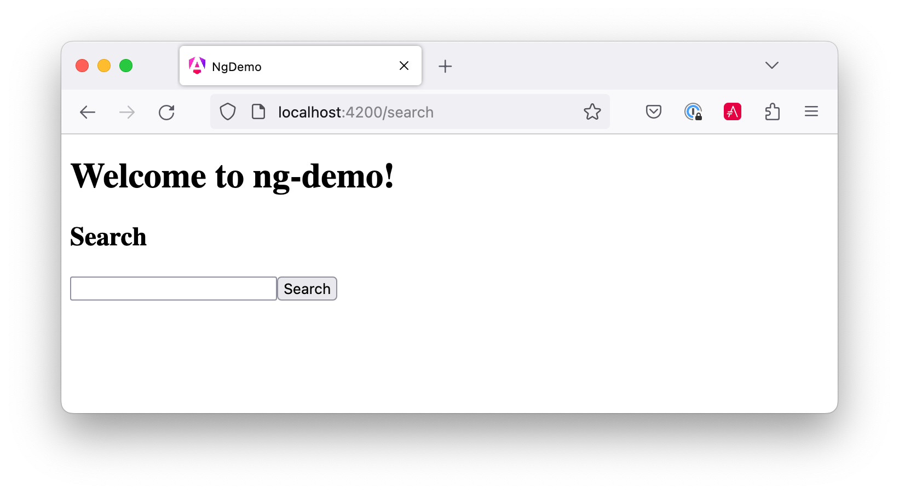
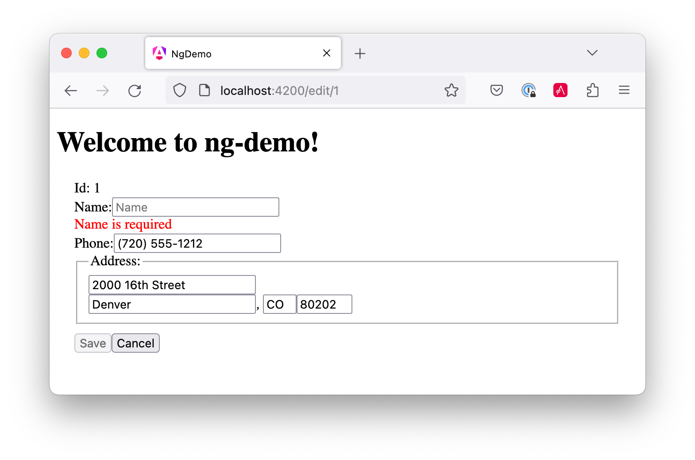
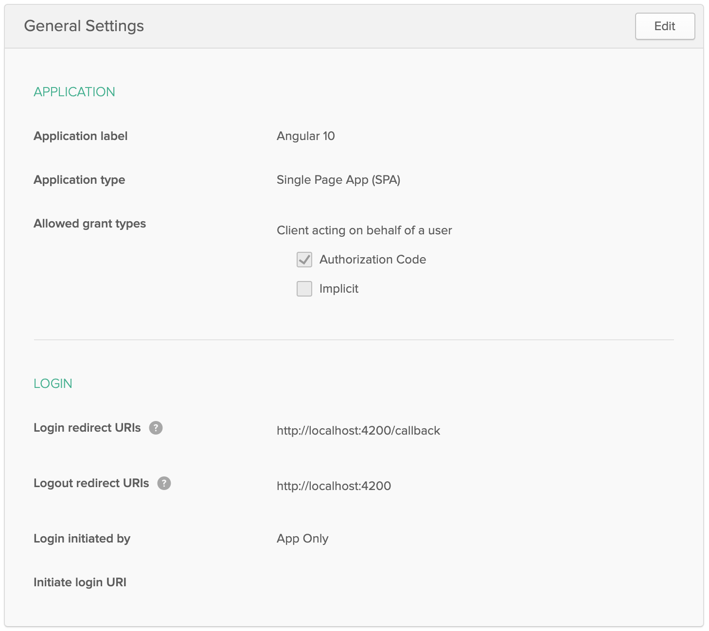
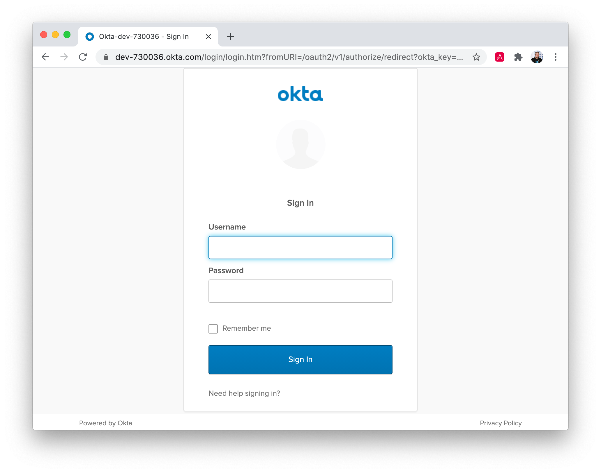

= &#x1F9B4; Bare Bones Angular and Angular CLI Tutorial

:author: Matt Raible
:email:  matt@raibledesigns.com
<<<<<<< HEAD
:revnumber: 9.0
=======
:revnumber: 10.0
>>>>>>> main
:revdate: {docdate}
:subject: Angular and Angular CLI
:keywords: Angular, Angular CLI, TypeScript, JavaScript, Node, npm, Jasmine, Protractor
:icons: font
:lang: en
:language: javadocript
:sourcedir: .
ifndef::env-github[]
:icons: font
endif::[]
ifdef::env-github,env-browser[]
:toc: preamble
:toclevels: 2
endif::[]
ifdef::env-github[]
:status:
:outfilesuffix: .adoc
:!toc-title:
:caution-caption: :fire:
:important-caption: :exclamation:
:note-caption: :paperclip:
:tip-caption: :bulb:
:warning-caption: :warning:
endif::[]
:toc: macro

This tutorial shows you how to build a bare-bones search and edit application using https://angular.io[Angular] and
<<<<<<< HEAD
https://github.com/angular/angular-cli[Angular CLI] version 9.0.

toc::[]

For older versions of Angular, please see previous tutorials:

* https://github.com/mraible/ng-demo/blob/6a24488ca847dea215ad70101a22f3ebf67ba79a/README.adoc[Angular 7]
* https://github.com/mraible/ng-demo/blob/41d9526dbc0a35131118f7f101938dfe75a0e212/README.adoc[Angular 6]
* https://github.com/mraible/ng-demo/blob/662159470802c53f445db6393576c0926e31d642/README.adoc[Angular 5]
=======
https://github.com/angular/angular-cli[Angular CLI] version 10.1.

toc::[]

For older versions of Angular, please see previous tutorials: https://github.com/mraible/ng-demo/blob/bec5fdf3b3da0419b012971ab42870df03ce94ea/README.adoc[Angular 9], https://github.com/mraible/ng-demo/blob/6a24488ca847dea215ad70101a22f3ebf67ba79a/README.adoc[Angular 7], https://github.com/mraible/ng-demo/blob/41d9526dbc0a35131118f7f101938dfe75a0e212/README.adoc[Angular 6], and https://github.com/mraible/ng-demo/blob/662159470802c53f445db6393576c0926e31d642/README.adoc[Angular 5].
>>>>>>> main

ifdef::env-github[]
TIP: It appears you're reading this document on GitHub. If you want a prettier view, install https://chrome.google.com/webstore/detail/asciidoctorjs-live-previe/iaalpfgpbocpdfblpnhhgllgbdbchmia[Asciidoctor.js Live Preview for Chrome], then view the https://raw.githubusercontent.com/mraible/ng-demo/master/README.adoc[raw document]. Another option is to use the https://gist.asciidoctor.org/?github-mraible%2Fng-demo%2Fmain%2F%2FREADME.adoc[DocGist view].
endif::[]

.Source Code
****
If you'd like to get right to it, the https://github.com/mraible/ng-demo[source is on GitHub]. To run the app, use `ng serve`. To test it, run `ng test`. To run its integration tests, run `ng e2e`.
****

toc::[]

== What you'll build

You'll build a simple web application with Angular CLI, a tool for Angular development. You'll create an application with search and edit features.

== What you'll need

* About 30 minutes.
<<<<<<< HEAD
* A favorite text editor or IDE. I recommend https://www.jetbrains.com/idea/[IntelliJ IDEA] and its
https://plugins.jetbrains.com/plugin/8395?pr=idea[Angular TypeScript Live Templates plugin].
* http://nodejs.org/[Node.js] and npm installed.
* https://github.com/angular/angular-cli[Angular CLI] installed. If you don't have Angular CLI installed, install it using `npm install -g @angular/cli@9.0.2`.
=======
* A favorite text editor or IDE. I recommend https://www.jetbrains.com/idea/[IntelliJ IDEA].
* http://nodejs.org/[Node.js] and npm installed.
* https://github.com/angular/angular-cli[Angular CLI] installed. If you don't have Angular CLI installed, install it using `npm install -g @angular/cli@10.1.0`.
>>>>>>> main

== Create your project

Create a new project using the `ng new` command:

----
ng new ng-demo
----

When prompted to install Angular routing, type "Y". For the stylesheet format, choose "CSS" (the default).

This will create a `ng-demo` project and run `npm install` in it. It takes about a minute to complete,
but will vary based on your internet connection speed.

You can see the what version of Angular CLI you're using with `ng version`.

----
$ ng version
<<<<<<< HEAD
=======

>>>>>>> main
     _                      _                 ____ _     ___
    / \   _ __   __ _ _   _| | __ _ _ __     / ___| |   |_ _|
   / △ \ | '_ \ / _` | | | | |/ _` | '__|   | |   | |    | |
  / ___ \| | | | (_| | |_| | | (_| | |      | |___| |___ | |
 /_/   \_\_| |_|\__, |\__,_|_|\__,_|_|       \____|_____|___|
                |___/

<<<<<<< HEAD
Angular CLI: 9.0.2
Node: 12.13.0
=======
Angular CLI: 10.1.0
Node: 14.8.0
>>>>>>> main
OS: darwin x64

Angular:
...
Ivy Workspace:

Package                      Version
------------------------------------------------------
<<<<<<< HEAD
@angular-devkit/architect    0.900.2
@angular-devkit/core         9.0.2
@angular-devkit/schematics   9.0.2
@schematics/angular          9.0.2
@schematics/update           0.900.2
rxjs                         6.5.3
=======
@angular-devkit/architect    0.1001.0
@angular-devkit/core         10.1.0
@angular-devkit/schematics   10.1.0
@schematics/angular          10.1.0
@schematics/update           0.1001.0
rxjs                         6.6.2
>>>>>>> main
----

If you run this command from the `ng-demo` directory, you'll see even more information.

----
     _                      _                 ____ _     ___
    / \   _ __   __ _ _   _| | __ _ _ __     / ___| |   |_ _|
   / △ \ | '_ \ / _` | | | | |/ _` | '__|   | |   | |    | |
  / ___ \| | | | (_| | |_| | | (_| | |      | |___| |___ | |
 /_/   \_\_| |_|\__, |\__,_|_|\__,_|_|       \____|_____|___|
                |___/

<<<<<<< HEAD
Angular CLI: 9.0.2
Node: 12.13.0
OS: darwin x64

Angular: 9.0.1
... animations, common, compiler, compiler-cli, core, forms
... language-service, platform-browser, platform-browser-dynamic
... router
=======
Angular CLI: 10.1.0
Node: 14.8.0
OS: darwin x64

Angular: 10.1.0
... animations, cli, common, compiler, compiler-cli, core, forms
... platform-browser, platform-browser-dynamic, router
>>>>>>> main
Ivy Workspace: Yes

Package                           Version
-----------------------------------------------------------
<<<<<<< HEAD
@angular-devkit/architect         0.900.2
@angular-devkit/build-angular     0.900.2
@angular-devkit/build-optimizer   0.900.2
@angular-devkit/build-webpack     0.900.2
@angular-devkit/core              9.0.2
@angular-devkit/schematics        9.0.2
@angular/cli                      9.0.2
@ngtools/webpack                  9.0.2
@schematics/angular               9.0.2
@schematics/update                0.900.2
rxjs                              6.5.4
typescript                        3.7.5
webpack                           4.41.2
=======
@angular-devkit/architect         0.1001.0
@angular-devkit/build-angular     0.1001.0
@angular-devkit/build-optimizer   0.1001.0
@angular-devkit/build-webpack     0.1001.0
@angular-devkit/core              10.1.0
@angular-devkit/schematics        10.1.0
@ngtools/webpack                  10.1.0
@schematics/angular               10.1.0
@schematics/update                0.1001.0
rxjs                              6.6.2
typescript                        4.0.2
webpack                           4.44.1
>>>>>>> main
----

== Run the application

The project is configured with a simple web server for development. To start it, run:

----
ng serve
----

You should see a screen like the one below at http://localhost:4200.

[[default-homepage]]
.Default homepage
image::src/assets/images/default-homepage.png[Default Homepage, 800, scaledwidth="100%"]

You can make sure your new project's tests pass, run `ng test`:

----
$ ng test
...
<<<<<<< HEAD
Chrome 80.0.3987 (Mac OS X 10.15.3): Executed 3 of 3 SUCCESS (0.197 secs / 0.137 secs)
=======
Chrome 85.0.4183.83 (Mac OS 10.15.6): Executed 3 of 3 SUCCESS (0.156 secs / 0.118 secs)
>>>>>>> main
----

== Add a search feature

To add a search feature, open the project in an IDE or your favorite text editor.

=== The Basics

In a terminal window, cd into your project's directory and run the following command to create a search component.

[source]
----
ng g component search
----

Open `src/app/search/search.component.html` and replace its default HTML with the following:

[source,html]
.src/app/search/search.component.html
----
<h2>Search</h2>
<form>
  <input type="search" name="query" [(ngModel)]="query" (keyup.enter)="search()">
  <button type="button" (click)="search()">Search</button>
</form>
<pre>{{searchResults | json}}</pre>
----

If you try to start your app at this point, you'll receive a compilation error.

----
ERROR in src/app/search/search.component.html:3:50 - error TS2339:
 Property 'query' does not exist on type 'SearchComponent'.
----

To fix this, add a `query` property to `src/app/search/search.component.ts`. While you're there, add a `searchResults` property and an empty `search()` method.

[source,typescript]
.src/app/search/search.component.ts
----
export class SearchComponent implements OnInit {
  query: string;
  searchResults: any;

  constructor() { }

<<<<<<< HEAD
  ngOnInit() {
  }

  search(): void {}
=======
  ngOnInit(): void { }

  search(): void { }
>>>>>>> main

}
----

.Adding a Search Route
****

The https://angular.io/guide/router[Router and navigation docs] for Angular provides the information you need to setup a route to the `SearchComponent` you just generated. Here's a quick summary:

In `src/app/app-routing.module.ts`, modify the `routes` constant to add `SearchComponent` as the default:

[source,typescript]
.src/app/app-routing.module.ts
----
import { SearchComponent } from './search/search.component';

const routes: Routes = [
  { path: 'search', component: SearchComponent },
  { path: '', redirectTo: '/search', pathMatch: 'full' }
];
----
****

Run `ng serve` again you will see a compilation error.

----
<<<<<<< HEAD
ERROR in src/app/search/search.component.html:3:37 - error TS8002:
Can't bind to 'ngModel' since it isn't a known property of 'input'.
=======
ERROR in src/app/search/search.component.html:3:37 - error NG8002:
 Can't bind to 'ngModel' since it isn't a known property of 'input'.
>>>>>>> main
----

To solve this, open `src/app/app.module.ts` and add `FormsModule` as an import in `@NgModule`:

[source,typescript]
.src/app/app.module.ts
----
import { FormsModule } from '@angular/forms';

@NgModule({
  ...
  imports: [
    ...
    FormsModule
  ]
  ...
})
export class AppModule { }
----

Now you should be able to see the search form.

[[search-component]]
.Search component

If yours looks different, it's because I trimmed my `app.component.html` to the bare minimum.

[source,html]
.src/app/app.component.html
----
<h1>Welcome to {{ title }}!</h1>

<router-outlet></router-outlet>
----

If you want to add CSS for this component, open `src/app/search/search.component.css` and add some CSS. For example:

[source,css]
.src/app/search/search.component.css
----
:host {
  display: block;
  padding: 0 20px;
}
----

This section has shown you how to generate a new component and add it to a basic Angular application with Angular CLI. The next section shows you how to create and use a JSON file and `localStorage` to create a fake API.

=== The Backend

To get search results, create a `SearchService` that makes HTTP requests to a JSON file. Start by generating a new service.

----
ng g service shared/search/search
----

Create `src/assets/data/people.json` to hold your data.

----
mkdir -p src/assets/data
----

[source,json]
.src/assets/data/people.json
----
[
  {
    "id": 1,
    "name": "Nikola Jokić",
    "phone": "(720) 555-1212",
    "address": {
      "street": "2000 16th Street",
      "city": "Denver",
      "state": "CO",
      "zip": "80202"
    }
  },
  {
    "id": 2,
    "name": "Jamal Murray",
    "phone": "(303) 321-8765",
    "address": {
      "street": "2654 Washington Street",
      "city": "Lakewood",
      "state": "CO",
      "zip": "80568"
    }
  },
  {
    "id": 3,
    "name": "Gary Harris",
    "phone": "(303) 323-1233",
    "address": {
      "street": "99 Westside Way",
      "city": "Breckenridge",
      "state": "CO",
      "zip": "82210"
    }
  }
]
----

Modify `src/app/shared/search/search.service.ts` and provide `HttpClient` as a dependency in its constructor.
<<<<<<< HEAD
In this same file, create a `getAll()` method to gather all the people. Also, define the `Address` and `Person` classes that JSON will be marshalled to.

=======

In this same file, create a `getAll()` method to gather all the people. Also, define the `Address` and `Person` classes that JSON will be marshalled to.

>>>>>>> main
[source,typescript]
.src/app/shared/search/search.service.ts
----
import { Injectable } from '@angular/core';
import { HttpClient } from '@angular/common/http';

@Injectable({
  providedIn: 'root'
})
export class SearchService {

  constructor(private http: HttpClient) { }

  getAll() {
    return this.http.get('assets/data/people.json');
  }
}

export class Address {
  street: string;
  city: string;
  state: string;
  zip: string;

  constructor(obj?: any) {
    this.street = obj && obj.street || null;
    this.city = obj && obj.city || null;
    this.state = obj && obj.state || null;
    this.zip = obj && obj.zip || null;
  }
}

export class Person {
  id: number;
  name: string;
  phone: string;
  address: Address;

  constructor(obj?: any) {
    this.id = obj && Number(obj.id) || null;
    this.name = obj && obj.name || null;
    this.phone = obj && obj.phone || null;
    this.address = obj && obj.address || null;
  }
}
----

To make these classes easier to consume by your components, create `src/app/shared/index.ts` and add the following:

[source,typescript]
.src/app/shared/index.ts
----
export * from './search/search.service';
----

The reason for creating this file is so you can import multiple classes on a single line rather than having to import each individual class on separate lines.

In `search.component.ts`, add imports for these classes.

[source,typescript]
.src/app/search/search.component.ts
----
import { Person, SearchService } from '../shared';
----

You can now add a proper type to the `searchResults` variable. While you're there, modify the constructor to inject the `SearchService`.

[source,typescript]
.src/app/search/search.component.ts
----
export class SearchComponent implements OnInit {
  query: string;
  searchResults: Array<Person>;

  constructor(private searchService: SearchService) { }
----

Then update the `search()` method to call the service's `getAll()` method.

[source,typescript]
.src/app/search/search.component.ts
----
search(): void {
  this.searchService.getAll().subscribe(
    (data: any) => { this.searchResults = data; },
    error => console.log(error)
  );
}
----

At this point, you'll likely see the following message in your browser's console.

----
NullInjectorError: No provider for HttpClient!
----

To fix the "No provider" error from above, update `app.module.ts` to import `HttpClientModule`.

[source,typescript]
.src/app/app.module.ts
----
import { HttpClientModule } from '@angular/common/http';

@NgModule({
  ...
  imports: [
    ...
    HttpClientModule
  ],
  providers: [],
  bootstrap: [AppComponent]
})
----

Now clicking the search button should work. To make the results look better, remove the `<pre>` tag and replace it with a `<table>` in `search.component.html`.

[source,xml]
.src/app/search/search.component.html
----
<table *ngIf="searchResults">
  <thead>
  <tr>
    <th>Name</th>
    <th>Phone</th>
    <th>Address</th>
  </tr>
  </thead>
  <tbody>
  <tr *ngFor="let person of searchResults; let i=index">
    <td>{{person.name}}</td>
    <td>{{person.phone}}</td>
    <td>{{person.address.street}} 
      {{person.address.city}}, {{person.address.state}} {{person.address.zip}}
    </td>
  </tr>
  </tbody>
</table>
----

Then add some additional CSS to `search.component.css` to improve its table layout.

[source,css]
.src/app/search/search.component.css
----
table {
  margin-top: 10px;
  border-collapse: collapse;
}

th {
  text-align: left;
  border-bottom: 2px solid #ddd;
  padding: 8px;
}

td {
  border-top: 1px solid #ddd;
  padding: 8px;
}
----

Now the search results look better.

[[search-results]]
.Search results
image::src/assets/images/search-results.png[Search Results, 800, scaledwidth="100%"]

But wait, you still don't have search functionality! To add a search feature, add a `search()` method to `SearchService`.

[source,typescript]
.src/app/shared/search/search.service.ts
----
import { Observable } from 'rxjs';
import { map } from 'rxjs/operators';
...

  search(q: string): Observable<any> {
    if (!q || q === '*') {
      q = '';
    } else {
      q = q.toLowerCase();
    }
    return this.getAll().pipe(
      map((data: any) => data
        .filter(item => JSON.stringify(item).toLowerCase().includes(q)))
    );
  }
----

Then refactor `SearchComponent` to call this method with its `query` variable.

[source,typescript]
.src/app/search/search.component.ts
----
search(): void {
  this.searchService.search(this.query).subscribe(
    (data: any) => { this.searchResults = data; },
    error => console.log(error)
  );
}
----

Now search results will be filtered by the query value you type in.

This section showed you how to fetch and display search results. The next section builds on this and shows how to edit and save a record.

== Add an edit feature

Modify `search.component.html` to wrap the person's name with a link.

[source,html]
.src/app/search/search.component.html
----
<td><a [routerLink]="['/edit', person.id]">{{person.name}}</a></td>
----

Run the following command to generate an `EditComponent`.

[source]
----
ng g component edit
----

Add a route for this component in `app-routing.module.ts`:

[source,typescript]
.src/app/app-routing.module.ts
----
import { EditComponent } from './edit/edit.component';

const routes: Routes = [
  { path: 'search', component: SearchComponent },
  { path: 'edit/:id', component: EditComponent },
  { path: '', redirectTo: '/search', pathMatch: 'full' }
];
----

Update `src/app/edit/edit.component.html` to display an editable form. You might notice I've added `id` attributes to most elements. This is to make things easier when writing integration tests with Protractor.

[source,html]
.src/app/edit/edit.component.html
----

  <h3>{{editName}}</h3>
  

    <label>Id:</label>
    {{person.id}}
  

  

    <label>Name:</label>
    <input [(ngModel)]="editName" name="name" id="name" placeholder="name"/>
  

  

    <label>Phone:</label>
    <input [(ngModel)]="editPhone" name="phone" id="phone" placeholder="Phone"/>
  

  <fieldset>
    <legend>Address:</legend>
    <address>
      <input [(ngModel)]="editAddress.street" id="street"> 
      <input [(ngModel)]="editAddress.city" id="city">,
      <input [(ngModel)]="editAddress.state" id="state" size="2">
      <input [(ngModel)]="editAddress.zip" id="zip" size="5">
    </address>
  </fieldset>
  <button (click)="save()" id="save">Save</button>
  <button (click)="cancel()" id="cancel">Cancel</button>

----

Modify `EditComponent` to import model and service classes and to use the `SearchService` to get data.

[source,typescript]
.src/app/edit/edit.component.ts
----
import { Component, OnInit, OnDestroy } from '@angular/core';
import { Address, Person, SearchService } from '../shared';
import { Subscription } from 'rxjs';
import { ActivatedRoute, Router } from '@angular/router';

@Component({
  selector: 'app-edit',
  templateUrl: './edit.component.html',
  styleUrls: ['./edit.component.css']
})
export class EditComponent implements OnInit, OnDestroy {
  person: Person;
  editName: string;
  editPhone: string;
  editAddress: Address;

  sub: Subscription;

  constructor(private route: ActivatedRoute,
              private router: Router,
              private service: SearchService) {
  }

  ngOnInit(): void {
    this.sub = this.route.params.subscribe(params => {
      const id = + params.id; // (+) converts string 'id' to a number
      this.service.get(id).subscribe(person => {
        if (person) {
          this.editName = person.name;
          this.editPhone = person.phone;
          this.editAddress = person.address;
          this.person = person;
        } else {
          this.gotoList();
        }
      });
    });
  }

<<<<<<< HEAD
  ngOnDestroy() {
=======
  ngOnDestroy(): void {
>>>>>>> main
    if (this.sub) {
      this.sub.unsubscribe();
    }
  }

  cancel() {
    this.router.navigate(['/search']);
  }

  save() {
    this.person.name = this.editName;
    this.person.phone = this.editPhone;
    this.person.address = this.editAddress;
    this.service.save(this.person);
    this.gotoList();
  }

  gotoList() {
    if (this.person) {
      this.router.navigate(['/search', {term: this.person.name} ]);
    } else {
      this.router.navigate(['/search']);
    }
  }
}
----

Modify `SearchService` to contain functions for finding a person by their id, and saving them. While you're in there, modify the `search()` method to be aware of updated objects in `localStorage`.

[source,typescript]
.src/app/shared/search/search.service.ts
----
search(q: string): Observable<any> {
  if (!q || q === '*') {
    q = '';
  } else {
    q = q.toLowerCase();
  }
  return this.getAll().pipe(
    map((data: any) => data
        .map(item => !!localStorage['person' + item.id] ?
          JSON.parse(localStorage['person' + item.id]) : item)
        .filter(item => JSON.stringify(item).toLowerCase().includes(q))
    ));
}

get(id: number) {
  return this.getAll().pipe(map((all: any) => {
    if (localStorage['person' + id]) {
      return JSON.parse(localStorage['person' + id]);
    }
    return all.find(e => e.id === id);
  }));
}

save(person: Person) {
  localStorage['person' + person.id] = JSON.stringify(person);
}
----

You can add CSS to `src/app/edit/edit.component.css` if you want to make the form look a bit better.

[source,css]
.src/app/edit/edit.component.css
----
:host {
  display: block;
  padding: 0 20px;
}

button {
  margin-top: 10px;
}
----

At this point, you should be able to search for a person and update their information.

[[edit-form]]
.Edit component
image::src/assets/images/edit-form.png[Edit form, 800, scaledwidth="100%"]

The &lt;form> in `src/app/edit/edit.component.html` calls a `save()` function to update a person's data. You already implemented this above.
The function calls a `gotoList()` function that appends the person's name to the URL when sending the user back to the search screen.

[source,typescript]
.src/app/edit/edit.component.ts
----
gotoList() {
  if (this.person) {
    this.router.navigate(['/search', {term: this.person.name} ]);
  } else {
    this.router.navigate(['/search']);
  }
}
----

Since the `SearchComponent` doesn't execute a search automatically when you execute this URL, add the following logic to do so in its `ngOnInit` method.

[source,typescript]
.src/app/search/search.component.ts
----
import { ActivatedRoute } from '@angular/router';
import { Subscription } from 'rxjs';
...

sub: Subscription;

constructor(private searchService: SearchService, private route: ActivatedRoute) { }

<<<<<<< HEAD
  ngOnInit() {
=======
  ngOnInit(): void {
>>>>>>> main
    this.sub = this.route.params.subscribe(params => {
      if (params.term) {
        this.query = decodeURIComponent(params.term);
        this.search();
      }
    });
  }
----

You'll want to implement `OnDestroy` and define the `ngOnDestroy` method to clean up this subscription.

[source,typescript]
.src/app/search/search.component.ts
----
import { Component, OnInit, OnDestroy } from '@angular/core';

export class SearchComponent implements OnInit, OnDestroy {
...
  ngOnDestroy(): void {
    if (this.sub) {
      this.sub.unsubscribe();
    }
  }
}
----

After making all these changes, you should be able to search/edit/update a person's information. If it works - nice job!

=== Form Validation

One thing you might notice is you can clear any input element in the form and save it. At the very least, the `name` field should be required. Otherwise, there's nothing to click on in the search results.

To make name required, modify `edit.component.html` to add a `required` attribute to the name `<input>` and bind it to Angular's validation with `#name="ngModel"`. Add a `
` next to the field to display an error message when validation fails.

[source,html]
.src/app/edit/edit.component.html
----
<input [(ngModel)]="editName" name="name" id="name" placeholder="name" required #name="ngModel"/>

  Name is required

----

<<<<<<< HEAD
You'll also need to wrap everything in a `<form>` element. Add `<form>` after the `<h3>` tag and close it before the last `
`. You'll also need to add an `(ngSubmit)` handler to the form, give it a name of `editForm`, change the save button to be a regular submit button that's disabled when the form is invalid.
=======
You'll also need to wrap everything in a `<form>` element. Add `<form>` after the `<h3>` tag and close it before the last `
`. You'll also need to add an `(ngSubmit)` handler to the form, give it a name of `editForm`, and change the save button to be a regular submit button that's disabled when the form is invalid.
>>>>>>> main

[source,html]
.src/app/edit/edit.component.html
----
<h3>{{editName}}</h3>
<form (ngSubmit)="save()" #editForm="ngForm">
  ...
  <button type="submit" id="save" [disabled]="!editForm.form.valid">Save</button>
  <button (click)="cancel()" id="cancel">Cancel</button>
</form>
----

After making these changes, the name field will be required.

[[edit-form-required]]
.Edit form with validation
image::src/assets/images/edit-form-validation.png[Edit form with validation, 800, scaledwidth="100%"]

In this screenshot, you might notice the address fields are blank and the save button is enabled. This is explained by the error in your console.

----
If ngModel is used within a form tag, either the name attribute must be set or the form control must be defined as 'standalone' in ngModelOptions.

Example 1: <input [(ngModel)]="person.firstName" name="first">
Example 2: <input [(ngModel)]="person.firstName" [ngModelOptions]="{standalone: true}">
----

To fix, add a `name` attribute to all the address fields. For example:

[source,html]
.src/app/edit/edit.component.html
----
<address>
  <input [(ngModel)]="editAddress.street" name="street" id="street"> 
  <input [(ngModel)]="editAddress.city" name="city" id="city">,
  <input [(ngModel)]="editAddress.state" name="state" id="state" size="2">
  <input [(ngModel)]="editAddress.zip" name="zip" id="zip" size="5">
</address>
----

Now values display in all fields, `name` is required, and save is enabled.

[[edit-form-names]]
.Edit form with names and validation

To learn more about forms and validation, see https://angular.io/guide/form-validation[Angular Forms Validation documentation].

== Testing

Now that you've built an application, it's important to test it to ensure it works. The best reason for writing tests is
to automate your testing. Without tests, you'll likely be testing manually. This manual testing will take longer and longer as your application grows.

[TIP]
====
If you didn't complete the previous section, you can clone the `ng-demo` repository and checkout the `test-start` branch.

----
git clone -b test-start https://github.com/mraible/ng-demo.git
cd ng-demo && npm i
----
====

In this section, you'll learn to use http://jasmine.github.io/[Jasmine] for unit testing controllers and http://www.protractortest.org/[Protractor] for integration testing. Angular's testing documentation lists https://angular.io/guide/testing[good reasons] to test, but doesn't currently have many examples.

=== Fix the Tests

If you run `ng test`, you'll likely get failures for the components and service you created. These failures will be solved as you complete the section below.

TIP: You can use `x` and `f` prefixes Jasmine's `describe` and `it` functions to _exclude_ only run only a particular test.

=== Fix the `AppComponent` test

<<<<<<< HEAD
If you changed the `app.component.html` template like I did, you'll need to modify `app.component.spec.ts` to account for the change in HTML. Change its last test to look for an `<h1>` element.
=======
If you changed the `app.component.html` template like I did, you'll need to modify `app.component.spec.ts` to account for the change in HTML. Change its last test to look for an `<h1>` element and the welcome message inside it.
>>>>>>> main

[source,ts]
.src/app/app/app.component.spec.ts
----
it('should render title', () => {
  const fixture = TestBed.createComponent(AppComponent);
  fixture.detectChanges();
  const compiled = fixture.nativeElement;
<<<<<<< HEAD
  expect(compiled.querySelector('h1').textContent).toContain('ng-demo app is running!');
=======
  expect(compiled.querySelector('h1').textContent).toContain('Welcome to ng-demo!');
>>>>>>> main
});
----

Now this test should pass.

=== Unit test the SearchService

Modify `src/app/shared/search/search.service.spec.ts` and setup the test's infrastructure (a.k.a. `TestBed`) using `HttpClientTestingModule` and `HttpTestingController`.

[source,typescript]
.src/app/shared/search/search.service.spec.ts
----
import { TestBed } from '@angular/core/testing';
import { SearchService } from './search.service';
import { HttpClientTestingModule, HttpTestingController } from '@angular/common/http/testing';

describe('SearchService', () => {
  let service: SearchService;
  let httpMock: HttpTestingController;

  beforeEach(() => {
    TestBed.configureTestingModule({
      imports: [HttpClientTestingModule],
      providers: [SearchService]
    });

    service = TestBed.inject(SearchService);
    httpMock = TestBed.inject(HttpTestingController);
  });

  it('should be created', () => {
    expect(service).toBeTruthy();
  });
});
----

If you run `ng test`, you will likely see some errors about the test stubs that Angular CLI created for you. You can ignore these for now.

----
NullInjectorError: R3InjectorError(DynamicTestModule)[SearchService -> HttpClient -> HttpClient]:
  NullInjectorError: No provider for HttpClient!

NullInjectorError: R3InjectorError(DynamicTestModule)[ActivatedRoute -> ActivatedRoute]:
  NullInjectorError: No provider for ActivatedRoute!
----

`HttpTestingController` allows you to mock requests and use its `flush()` method to provide response values. Since the HTTP request methods return an `Observable`, you can subscribe to it and create expectations in the callback methods. Add the first test of `getAll()` to `search.service.spec.ts`.

The test below should be on the same level as `beforeEach`.

[source,typescript]
.src/app/shared/search/search.service.spec.ts
----
it('should retrieve all search results', () => {
  const mockResponse = [
    {name: 'Nikola Jokić'},
    {name: 'Mike Malone'}
  ];

  service.getAll().subscribe((people: any) => {
    expect(people.length).toBe(2);
    expect(people[0].name).toBe('Nikola Jokić');
    expect(people).toEqual(mockResponse);
  });

  const req = httpMock.expectOne('assets/data/people.json');
  expect(req.request.method).toBe('GET');
  req.flush(mockResponse);
});
----

While you're there, add an `afterEach()` to verify requests.

[source,typescript]
.src/app/shared/search/search.service.spec.ts
----
afterEach(() => {
  httpMock.verify();
});
----

Add a couple more tests for filtering by search term and fetching by id.

[source,typescript]
.src/app/shared/search/search.service.spec.ts
----
it('should filter by search term', () => {
  const mockResponse = [{name: 'Nikola Jokić'}];

  service.search('nik').subscribe((people: any) => {
    expect(people.length).toBe(1);
    expect(people[0].name).toBe('Nikola Jokić');
  });

  const req = httpMock.expectOne('assets/data/people.json');
  expect(req.request.method).toBe('GET');
  req.flush(mockResponse);
});

it('should fetch by id', () => {
  const mockResponse = [
    {id: 1, name: 'Nikola Jokić'},
    {id: 2, name: 'Mike Malone'}
  ];

  service.get(2).subscribe((person: any) => {
    expect(person.name).toBe('Mike Malone');
  });

  const req = httpMock.expectOne('assets/data/people.json');
  expect(req.request.method).toBe('GET');
  req.flush(mockResponse);
});
----

=== Unit test the SearchComponent

To unit test the `SearchComponent`, you can mock the methods in `SearchService` with http://angular-tips.com/blog/2014/03/introduction-to-unit-test-spies/[spies]. These allow you to _spy_ on functions to check if they were called.
<<<<<<< HEAD

Create `src/app/shared/search/mocks/routes.ts` to mock Angular's `Router` and `ActivatedRoute`.

=======

Create `src/app/shared/search/mocks/routes.ts` to mock Angular's `Router` and `ActivatedRoute`.

>>>>>>> main
[source,typescript]
.src/app/shared/search/mocks/routes.ts
----
import { ActivatedRoute, Params } from '@angular/router';
import { Observable, of } from 'rxjs';

export class MockActivatedRoute extends ActivatedRoute {
  params: Observable<Params>;

  constructor(parameters?: { [key: string]: any; }) {
    super();
    this.params = of(parameters);
  }
}

export class MockRouter {
  navigate = jasmine.createSpy('navigate');
}
----

<<<<<<< HEAD
With this mock in place, you can `TestBed.configureTestingModule()` to setup `SearchComponent` to use it as a provider. In the second `beforeEach()`, you can see that the `search()` method is spied on and its results are mocked. The response isn't important in this case because you're just unit testing the `EditComponent`.
=======
With this mock in place, you can `TestBed.configureTestingModule()` to setup `SearchComponent` to use it as a provider. In the second `beforeEach()`, you can see that the `search()` method is spied on and its results are mocked. The response isn't important in this case because you're just unit testing the `SearchComponent`.
>>>>>>> main

[source,typescript]
.src/app/search/search.component.spec.ts
----
import { ComponentFixture, TestBed } from '@angular/core/testing';
import { SearchComponent } from './search.component';
import { SearchService } from '../shared';
import { ActivatedRoute } from '@angular/router';
import { RouterTestingModule } from '@angular/router/testing';
import { FormsModule } from '@angular/forms';
<<<<<<< HEAD
import { MockActivatedRoute, MockRouter } from '../shared/search/mocks/routes';
=======
import { MockActivatedRoute } from '../shared/search/mocks/routes';
import { of } from 'rxjs';
import { HttpClientTestingModule } from '@angular/common/http/testing';
>>>>>>> main

describe('SearchComponent', () => {
  let component: SearchComponent;
  let fixture: ComponentFixture<SearchComponent>;
  let mockSearchService: SearchService;
  let mockActivatedRoute: MockActivatedRoute;

<<<<<<< HEAD
  beforeEach(async(() => {
    mockActivatedRoute = new MockActivatedRoute({'term': 'nikola'});
=======
  beforeEach((() => {
    mockActivatedRoute = new MockActivatedRoute({term: 'nikola'});
>>>>>>> main

    TestBed.configureTestingModule({
      declarations: [SearchComponent],
      providers: [
        {provide: ActivatedRoute, useValue: mockActivatedRoute}
      ],
      imports: [FormsModule, RouterTestingModule, HttpClientTestingModule]
    }).compileComponents();
  }));

  beforeEach(() => {
    // mock response
    mockSearchService = TestBed.inject(SearchService);
    mockSearchService.search = jasmine.createSpy().and.returnValue(of([]));

    // initialize component
    fixture = TestBed.createComponent(SearchComponent);
    component = fixture.componentInstance;
    fixture.detectChanges();
  });

  it('should create', () => {
    expect(component).toBeTruthy();
  });
});
----

Add two tests, one to verify a search term is used when it's set on the component, and a second to verify search is called when a term is passed in as a route parameter.

[source,typescript]
.src/app/search/search.component.spec.ts
----
it('should search when a term is set and search() is called', () => {
  component = fixture.debugElement.componentInstance;
  component.query = 'J';
  component.search();
  expect(mockSearchService.search).toHaveBeenCalledWith('J');
});

it('should search automatically when a term is on the URL', () => {
  fixture.detectChanges();
  expect(mockSearchService.search).toHaveBeenCalledWith('nikola');
});
----

Update the test for `EditComponent`, verifying fetching a single record works. Notice how you can access the component directly with `fixture.debugElement.componentInstance`, or its rendered version with `fixture.debugElement.nativeElement`.

[source,typescript]
.src/app/edit/edit.component.spec.ts
----
import { EditComponent } from './edit.component';
import { TestBed } from '@angular/core/testing';
import { Address, Person, SearchService } from '../shared';
<<<<<<< HEAD
import { MockRouter, MockActivatedRoute } from '../shared/search/mocks/routes';
=======
import { MockActivatedRoute, MockRouter } from '../shared/search/mocks/routes';
>>>>>>> main
import { ActivatedRoute, Router } from '@angular/router';
import { FormsModule } from '@angular/forms';
import { of } from 'rxjs';
import { HttpClientTestingModule } from '@angular/common/http/testing';

describe('EditComponent', () => {
  let mockSearchService: SearchService;
  let mockActivatedRoute: MockActivatedRoute;
  let mockRouter: MockRouter;

  beforeEach(() => {
    mockActivatedRoute = new MockActivatedRoute({id: 1});
    mockRouter = new MockRouter();

    TestBed.configureTestingModule({
      declarations: [EditComponent],
      providers: [
        {provide: ActivatedRoute, useValue: mockActivatedRoute},
        {provide: Router, useValue: mockRouter}
      ],
      imports: [FormsModule, HttpClientTestingModule]
    }).compileComponents();

    mockSearchService = TestBed.inject(SearchService);
  });

  it('should fetch a single record', () => {
    const fixture = TestBed.createComponent(EditComponent);

    const person = new Person({id: 1, name: 'Gary Harris'});
    person.address = new Address({city: 'Denver'});

    // mock response
    spyOn(mockSearchService, 'get').and.returnValue(of(person));

    // initialize component
    fixture.detectChanges();

    // verify service was called
    expect(mockSearchService.get).toHaveBeenCalledWith(1);

    // verify data was set on component when initialized
    const editComponent = fixture.debugElement.componentInstance;
    expect(editComponent.editAddress.city).toBe('Denver');

    // verify HTML renders as expected
    const compiled = fixture.debugElement.nativeElement;
    expect(compiled.querySelector('h3').innerHTML).toBe('Gary Harris');
  });
});

----

<<<<<<< HEAD
You should see "Executed 11 of 11 [green]#SUCCESS# (0.192 secs / 0.141 secs)" in the shell window that's running `ng test`. If you don't, try cancelling the command and restarting.
=======
You should see "Executed 11 of 11 [green]#SUCCESS# (0.118 secs / 0.096 secs)" in the shell window that's running `ng test`. If you don't, try cancelling the command and restarting.
>>>>>>> main

=== Integration test the search UI

To test if the application works end-to-end, you can write tests with http://www.protractortest.org/[Protractor]. These are also known as integration tests, since they test the _integration_ between all layers of your application.

To verify end-to-end tests work in the project before you begin, run the following command in a terminal window.

----
ng e2e
----

You'll likely see the following error:

----
1) workspace-project App should display welcome message
  - Failed: No element found using locator: By(css selector, app-root .content span)
----

This happens because you changed the HTML structure of `app.component.html`. To fix it, change the selector in `app.po.ts` to look for the `<h1>` element.

[source,ts]
.e2e/src/app.po.ts
----
<<<<<<< HEAD
getTitleText() {
=======
getTitleText(): Promise<string> {
>>>>>>> main
  return element(by.css('app-root h1')).getText() as Promise<string>;
}
----

<<<<<<< HEAD
Now you should be able to run `ng e2e` and have everything pass.
=======
You'll also need to change the test in `app.e2e-spec.ts` to use the new welcome message.
>>>>>>> main

[source,ts]
.e2e/src/app.e2e-spec.ts
----
<<<<<<< HEAD
$ ng e2e
[16:18:12] I/config_source - curl -o/Users/mraible/ng-demo/node_modules/protractor/node_modules/webdriver-manager/selenium/chrome-response.xml https://chromedriver.storage.googleapis.com/
[16:18:13] I/update - chromedriver: file exists /Users/mraible/ng-demo/node_modules/protractor/node_modules/webdriver-manager/selenium/chromedriver_80.0.3987.106.zip
[16:18:13] I/update - chromedriver: unzipping chromedriver_80.0.3987.106.zip
[16:18:13] I/update - chromedriver: setting permissions to 0755 for /Users/mraible/ng-demo/node_modules/protractor/node_modules/webdriver-manager/selenium/chromedriver_80.0.3987.106
[16:18:13] I/update - chromedriver: chromedriver_80.0.3987.106 up to date

chunk {main} main.js, main.js.map (main) 43.5 kB [initial] [rendered]
chunk {polyfills} polyfills.js, polyfills.js.map (polyfills) 140 kB [initial] [rendered]
chunk {runtime} runtime.js, runtime.js.map (runtime) 6.15 kB [entry] [rendered]
chunk {styles} styles.js, styles.js.map (styles) 9.7 kB [initial] [rendered]
chunk {vendor} vendor.js, vendor.js.map (vendor) 3.38 MB [initial] [rendered]
Date: 2020-02-18T00:18:22.499Z - Hash: 3fac0c4de320c4fe0b2c - Time: 5627ms
** Angular Live Development Server is listening on localhost:4200, open your browser on http://localhost:4200/ **
ℹ ｢wdm｣: Compiled successfully.
[16:18:23] I/launcher - Running 1 instances of WebDriver
[16:18:23] I/direct - Using ChromeDriver directly...
Jasmine started

  workspace-project App
    ✓ should display welcome message

Executed 1 of 1 spec SUCCESS in 0.586 sec.
[16:18:27] I/launcher - 0 instance(s) of WebDriver still running
[16:18:27] I/launcher - chrome #01 passed
Execution time: 10 s.
=======
it('should display welcome message', () => {
  page.navigateTo();
  expect(page.getTitleText()).toEqual('Welcome to ng-demo!');
});
----

Now you should be able to run `ng e2e` and have everything pass.

----
$ ng e2e
[23:47:29] I/update - chromedriver: file exists /Users/mraible/ng-demo/node_modules/protractor/node_modules/webdriver-manager/selenium/chromedriver_85.0.4183.87.zip
[23:47:29] I/update - chromedriver: unzipping chromedriver_85.0.4183.87.zip
[23:47:29] I/update - chromedriver: setting permissions to 0755 for /Users/mraible/ng-demo/node_modules/protractor/node_modules/webdriver-manager/selenium/chromedriver_85.0.4183.87
[23:47:29] I/update - chromedriver: chromedriver_85.0.4183.87 up to date

chunk {main} main.js, main.js.map (main) 41.5 kB [initial] [rendered]
chunk {polyfills} polyfills.js, polyfills.js.map (polyfills) 141 kB [initial] [rendered]
chunk {runtime} runtime.js, runtime.js.map (runtime) 6.15 kB [entry] [rendered]
chunk {styles} styles.js, styles.js.map (styles) 12.5 kB [initial] [rendered]
chunk {vendor} vendor.js, vendor.js.map (vendor) 2.99 MB [initial] [rendered]
Date: 2020-09-05T05:47:35.554Z - Hash: 1f37ff085dda89695218 - Time: 4956ms
** Angular Live Development Server is listening on localhost:4200, open your browser on http://localhost:4200/ **
: Compiled successfully.
[23:47:35] I/launcher - Running 1 instances of WebDriver
[23:47:35] I/direct - Using ChromeDriver directly...
Jasmine started

  workspace-project App
    ✓ should display welcome message

Executed 1 of 1 spec SUCCESS in 0.315 sec.
[23:47:38] I/launcher - 0 instance(s) of WebDriver still running
[23:47:38] I/launcher - chrome #01 passed
Execution time: 11 s.
>>>>>>> main
----

=== Testing the search feature

Create end-to-end tests in `e2e/src/search.e2e-spec.ts` to verify the search feature works. Populate it with the following code:

[source,typescript]
.e2e/src/search.e2e-spec.ts
----
import { browser, by, element } from 'protractor';

describe('Search', () => {

  beforeEach(async () => {
    await browser.get('/search');
  });

  it('should have an input and search button', () => {
    expect(element(by.css('app-root app-search form input')).isPresent()).toEqual(true);
    expect(element(by.css('app-root app-search form button')).isPresent()).toEqual(true);
  });

  it('should allow searching', async () => {
    const searchButton = element(by.css('button'));
    const searchBox = element(by.css('input'));
    await searchBox.sendKeys('A');
    await searchButton.click();
    const list = element.all(by.css('app-search table tbody tr'));
    expect(list.count()).toBe(3);
  });
});
----

=== Testing the edit feature

Create a `e2e/src/edit.e2e-spec.ts` test to verify the `EditComponent` renders a person's information and that their information can be updated.

[source,typescript]
.e2e/src/edit.e2e-spec.ts
----
import { browser, by, element } from 'protractor';

describe('Edit', () => {

  beforeEach(async () => {
    await browser.get('/edit/1');
  });

  const name = element(by.id('name'));
  const street = element(by.id('street'));
  const city = element(by.id('city'));

  it('should allow viewing a person', async () => {
    expect(await element(by.css('h3')).getText()).toEqual('Nikola Jokić');
    expect(await name.getAttribute('value')).toEqual('Nikola Jokić');
    expect(await street.getAttribute('value')).toEqual('2000 16th Street');
    expect(await city.getAttribute('value')).toEqual('Denver');
  });

  it('should allow updating a name', async () => {
    const save = element(by.id('save'));
    name.sendKeys(' Rocks!');
    await save.click();
    // verify one element matched this change
    const list = element.all(by.css('app-search table tbody tr'));
    expect(list.count()).toBe(1);
  });
});
----

Run `ng e2e` to verify all your end-to-end tests pass. You should see a success message similar to the one below in your terminal window.

[[protractor-success]]
.Protractor success
image::src/assets/images/protractor-success.png[Protractor success, 800, scaledwidth="100%"]

If you made it this far and have all your specs passing - congratulations! You're well on your way to writing quality code with Angular and verifying it works.

You can see the test coverage of your project by running `ng test --codeCoverage=true`.
<<<<<<< HEAD

You'll see a print out of code coverage in your terminal window.

----
=============================== Coverage summary ===============================
Statements   : 80.82% ( 59/73 )
Branches     : 71.43% ( 30/42 )
Functions    : 83.33% ( 25/30 )
Lines        : 79.1% ( 53/67 )
================================================================================
----

You can also open `coverage/index.html` in your browser.

=======

You'll see a print out of code coverage in your terminal window.

----
=============================== Coverage summary ===============================
Statements   : 80.56% ( 58/72 )
Branches     : 71.43% ( 30/42 )
Functions    : 82.76% ( 24/29 )
Lines        : 78.79% ( 52/66 )
================================================================================
----

You can also open `coverage/ng-demo/index.html` in your browser.

>>>>>>> main
You might notice that the `EditComponent` could use some additional coverage. If you feel the need to improve this coverage, please create a pull request!

[[test-coverage]]
.Test coverage
image::src/assets/images/test-coverage.png[Test coverage, 800, scaledwidth="100%"]

== Continuous Integration

<<<<<<< HEAD
At the time of this writing, Angular CLI did not have any continuous integration support. This section shows you how to setup continuous integration with https://travis-ci.org/[Travis CI] and https://jenkins.io/[Jenkins].
=======
At the time of this writing, Angular CLI did not have any continuous integration support. This section shows you how to setup continuous integration with https://github.com/features/actions[GitHub Actions], https://travis-ci.org/[Travis CI] and https://jenkins.io/[Jenkins].

CAUTION: In the commands below, I use `master` as the branch name. I use this because it's the default. I recommend you https://www.hanselman.com/blog/EasilyRenameYourGitDefaultBranchFromMasterToMain.aspx[change your default branch name to `main`].

=== GitHub Actions

If you've checked your project into GitHub, you can use GitHub Actions.

Create a `.github/workflows/main.yml` file. Add the following YAML to it. This will run both unit tests and integrations tests.

[source,yaml]
----
name: Angular

on: [push, pull_request]

jobs:
  build:
    name: Build and Test
    runs-on: ubuntu-latest
    steps:
      - name: Checkout
        uses: actions/checkout@v2
      - name: Use Node 12.x
        uses: actions/setup-node@v1
        with:
          node-version: '14.x'
      - name: Install latest Chrome
        run: |
          sudo apt update
          sudo apt --only-upgrade install google-chrome-stable
          google-chrome --version
      - name: Install dependencies
        run: npm ci
      - name: Run unit tests
        run: xvfb-run npm test -- --watch=false
      - name: Run integration tests
        run: xvfb-run --server-args="-screen 0 1024x768x24" --auto-servernum npm run e2e
----

Check it in on a branch, create a pull request for that branch, and you should see your tests running.

https://github.com/mraible/ng-demo/pull/76/checks?check_run_id=1107490951[Here is a build] showing all unit and integration tests passing.
>>>>>>> main

=== Travis CI

If you've checked in your project to GitHub, you can use Travis CI.

. Login to https://travis-ci.org/[Travis CI] and enable builds for the GitHub repo you published the project to.
. Add the following `.travis.yml` in your root directory and `git commit/push` it. This will trigger the first build.

[source,yaml]
----
dist: bionic
os:
  - linux
services:
  - docker
  - xvfb
language: node_js
node_js:
<<<<<<< HEAD
  - "12.13.0"
=======
  - "14.x"
>>>>>>> main
addons:
  apt:
    packages:
      - dpkg
  chrome: stable
cache:
  directories:
  - node_modules
branches:
  only:
  - master
<<<<<<< HEAD
before_install:
  - npm install -g @angular/cli
=======
>>>>>>> main
install:
  - npm ci
script:
  - npm test -- --watch=false
  - npm run e2e
notifications:
  webhooks:
    on_success: change
    on_failure: always
    on_start: false
----

<<<<<<< HEAD
https://travis-ci.org/mraible/ng-demo/builds/610233616[Here] is a build showing all unit and integration tests passing.
=======
https://travis-ci.org/github/mraible/ng-demo/builds/726701970[Here is a build] showing all unit and integration tests passing.
>>>>>>> main

=== Jenkins

If you've checked your project into source control, you can use Jenkins to automate testing.

. Create a `Jenkinsfile` in the root directory and commit/push it.

----
node {
<<<<<<< HEAD
    def nodeHome = tool name: 'node-12.13.0', type: 'jenkins.plugins.nodejs.tools.NodeJSInstallation'
=======
    def nodeHome = tool name: 'node-14.x', type: 'jenkins.plugins.nodejs.tools.NodeJSInstallation'
>>>>>>> main
    env.PATH = "${nodeHome}/bin:${env.PATH}"

    stage('check tools') {
        sh "node -v"
        sh "npm -v"
    }

    stage('checkout') {
        checkout scm
    }

    stage('npm install') {
        sh "npm install"
    }

    stage('unit tests') {
        sh "npm test -- --watch=false"
    }

    stage('protractor tests') {
        sh "npm run e2e"
    }
}
----

[start=2]
<<<<<<< HEAD
. Download https://jenkins.io/download/[Jenkins] and install it on your local hard drive. Start it using `java -jar jenkins.war`.
. Login to Jenkins and create a new project with an SCM Pipeline. Point it at your project's repository. Run a build.
=======
. Install https://jenkins.io/download/[Jenkins] on your hard drive and start it.
. Login to Jenkins at `http://localhost:8080` and install the Node.js plugin.
. Go to **Manage Jenkins** > **Global Tool Configuration** > **NodeJS**. Install and configure the name of your Node.js installation to match your build script.
. Create a new project with **Pipeline** > **Pipeline script from SCM** (near the bottom). Point it at your project's repository.
. Click **Build Now**.
>>>>>>> main

== Deployment

This section shows you how to deploy an Angular app to http://run.pivotal.io[Cloud Foundry] and https://heroku.com[Heroku].

=== Cloud Foundry

https://account.run.pivotal.io/z/uaa/sign-up[Create a Pivotal account] and https://docs.run.pivotal.io/cf-cli/install-go-cli.html[install the cf CLI].

Login to your account.

[source,bash]
----
<<<<<<< HEAD
=======
cf login -a api.run.pivotal.io
----

Then run the following commands to build and deploy your application.

[source,bash]
----
>>>>>>> main
ng build --prod
cd dist && touch Staticfile
# enable pushstate so no 404s on refresh
echo 'root: ng-demo\npushstate: enabled' > Staticfile
cf push ng-demo
----

NOTE: You might need to use an app name other than `ng-demo`. For example, `coolest-ever`.

=== Heroku

https://signup.heroku.com/[Create a Heroku account], https://devcenter.heroku.com/articles/heroku-cli[install the heroku CLI], and run `heroku login`.

Then run the following commands to build and deploy your application.

Run `heroku create` to create an app on Heroku.

Create a `static.json` file with the configuration for secure headers and redirect all HTTP requests to HTTPS.

[source,json]
----
{
  "headers": {
    "/**": {
      "Content-Security-Policy": "default-src 'self'; script-src 'self' 'unsafe-eval'; style-src 'self' 'unsafe-inline'; img-src 'self' data:; font-src 'self' data:; frame-ancestors 'none'; connect-src 'self' https://*.okta.com https://*.herokuapp.com",
      "Referrer-Policy": "no-referrer, strict-origin-when-cross-origin",
      "Strict-Transport-Security": "max-age=63072000; includeSubDomains",
      "X-Content-Type-Options": "nosniff",
      "X-Frame-Options": "DENY",
      "X-XSS-Protection": "1; mode=block",
      "Feature-Policy": "accelerometer 'none'; camera 'none'; microphone 'none'"
    }
  },
  "https_only": true,
  "root": "dist/ng-demo/",
  "routes": {
    "/**": "index.html"
  }
}
----

NOTE: In this code, you might notice that some https URLs are allowed in the content security policy. Those are there this app can make XHR requests to those domains when that functionality is added.

For `static.json` to be read, you have to use the https://github.com/heroku/heroku-buildpack-static[Heroku static buildpack].

Add `--prod` to the `build` script since the static buildback uses this command.

[source,json]
.package.json
----
"scripts": {
  "ng": "ng",
  "start": "ng serve",
  "build": "ng build --prod",
  "test": "ng test",
  "lint": "ng lint",
  "e2e": "ng e2e"
},
----

<<<<<<< HEAD
. Add a `heroku-postbuild` script to `package.json`:

  "heroku-postbuild": "ng build --prod && npm install -g http-server-spa"
=======
Commit your changes to Git, add the Node.js + static buildpack, and redeploy your Angular app.

[source,shell]
----
git add .
git commit -m "Configure secure headers and static buildpack"
heroku buildpacks:add heroku/nodejs
heroku buildpacks:add https://github.com/heroku/heroku-buildpack-static.git
git push heroku master
----

View the application in your browser with `heroku open`. Try your app's URL on <https://securityheaders.com> to be pleasantly suprised.
>>>>>>> main

TIP: You can watch your app's logs using `heroku logs --tail`.

== Source code

A completed project with this code in it is available on GitHub at https://github.com/mraible/ng-demo.

== Summary

I hope you've enjoyed this in-depth tutorial on how to get started with Angular and Angular CLI. Angular CLI takes much of the pain out of setting up an Angular project and using Typescript. I expect great things from Angular CLI, mostly because the Angular setup process can be tedious and CLI greatly simplifies things.
<<<<<<< HEAD

== Bonus: Okta

To integrate http://developer.okta.com[Okta] for user authentication, you'll first need to https://developer.okta.com/signup/[register] and create an OpenID Connect application.

You can also install the [Okta CLI](https://github.com/oktadeveloper/okta-cli) and run `okta register`.

=== Create an OpenID Connect App in Okta

OpenID Connect is built on top of the OAuth 2.0 protocol. It allows clients to verify the identity of the user and, as well as to obtain their basic user information.

Login to your Okta account, or use the Okta CLI and run `okta apps create`.

* Navigate to *Applications* > *Add Application*.
* Select *Single-Page App (SPA)* and click *Next*.
* Click *Create* and give your application a name (e.g., "Angular 10").
* On the next screen, change all URIs to use port `4200` and add `http://localhost:4200/callback` as a *Login redirect URI*.
* Select **Authorization Code** as a grant type and click *Done*.

When you are finished, your settings should look similar to the screenshot below.

.OIDC App Settings

=== Add OIDC Authentication with OktaDev Schematics

Use https://github.com/oktadeveloper/schematics[OktaDev Schematics] to add OAuth 2.0 and OpenID Connect (OIDC) support.

----
ng add @oktadev/schematics
----

You'll be prompted for an issuer, which you can find in your Okta dashboard at **API** > **Authorization Servers**. For the client ID, use the Client ID from the app you just created.

This process will perform the following steps for you.

1. Install the https://github.com/okta/okta-oidc-js/tree/master/packages/okta-angular[Okta Angular SDK] using `npm install @okta/okta-angular`.
2. Add `src/app/auth-routing.module.ts` with OIDC configuration and initialization logic.
3. Create and configure an `HttpInterceptor` (in `src/app/shared/okta/auth.interceptor.ts`) that adds an Authorization header to outbound requests.
4. Add authenticated logic to `src/app/app.component.ts`.
5. Create a `HomeComponent` and configures it with authentication logic.

Remove the default route from `app-routing.ts` and add a route guard to the `/search` and `/edit` routes.

[source,ts]
.src/app/app-routing.ts
----
import { OktaAuthGuard } from '@okta/okta-angular';

const routes: Routes = [
  {path: 'search', component: SearchComponent, canActivate: [OktaAuthGuard]},
  {path: 'edit/:id', component: EditComponent, canActivate: [OktaAuthGuard]},
];
----

This is necessary because the `HomeComponent` has a default route configured in `src/app/auth-routing.ts`. The `OktaAuthGuard` makes authentication required.

[source,typescript]
----
const routes: Routes = [
  { path: '', redirectTo: '/home', pathMatch: 'full' },
  {
    path: 'home',
    component: HomeComponent
  },
  {
    path: 'callback',
    component: OktaCallbackComponent
  }
];
----

After making these changes, you should be able to run `ng serve` and see a login button at http://localhost:4200.

[[okta-login-button]]
.Okta login button
image::src/assets/images/okta-login-button.png[Login button, 800, scaledwidth="100%"]

Click the *Login* button and sign-in with one of the people that's configured in your Okta application.

[[okta-login]]
.Okta login form

=== Display Authenticated User's Name

To display the authenticated user's name, modify `home.component.ts` to add a `user` property and fetch the user in `ngOnInit()`.

[source,ts]
.src/app/home/home.component.ts
----
export class HomeComponent implements OnInit {
  isAuthenticated = false;
  user: any;

  constructor(public oktaAuth: OktaAuthService) {
  }

  async ngOnInit(): Promise<void> {
    this.isAuthenticated = await this.oktaAuth.isAuthenticated();
    // Subscribe to authentication state changes
    this.oktaAuth.$authenticationState.subscribe(
      (isAuthenticated: boolean)  => this.isAuthenticated = isAuthenticated
    );
    if (this.isAuthenticated) {
      this.user = await this.oktaAuth.getUser();
    }
  }
}
----

Then modify `home.component.html` to display a welcome message to the user and provide them with a link to search.

[source,html]
.src/app/home/home.component.html
----

    <button *ngIf="!isAuthenticated" (click)="oktaAuth.loginRedirect()" id="login">Login</button>
    

        <h2>Welcome, {{user?.name}}!</h2>
        
<a routerLink="/search" routerLinkActive="active">Search</a>

    

    <button *ngIf="isAuthenticated" (click)="oktaAuth.logout()" id="logout">Logout</button>

----

Refresh your app and you should see your name with a link to *Search*.

[[okta-post-login]]
.View after login
image::src/assets/images/okta-post-login.png[View after login, 800, scaledwidth="100%"]

If you logout and manually navigate to http://localhost:4200/search, you'll be required to log in.

If everything works - congrats! 🥳

==== Add authentication to tests

To make it so you can run your e2e tests with authentication, create a `e2e/src/login.po.ts` file.

[source,ts]
----
import { browser, by, element, ExpectedConditions as ec } from 'protractor';

export class LoginPage {
  username = element(by.name('username'));
  password = element(by.name('password'));
  // button on IdP sign-in form
  loginButton = element(by.css('input[type=submit]'));
  signInButton = element(by.id('login'));
  logoutButton = element(by.id('logout'));
  welcomeMessage = element(by.css('h2'));

  async login(): Promise<void> {
    await browser.get('/');
    await browser.wait(ec.visibilityOf(this.signInButton));
    await this.signInButton.click();
    // You must set E2E_USERNAME, E2E_PASSWORD, and E2E_NAME as environment variables
    await this.loginToIdP(process.env.E2E_USERNAME, process.env.E2E_PASSWORD);
    const welcome = new RegExp('Welcome, ' + process.env.E2E_NAME);
    await browser.wait(ec.visibilityOf(this.logoutButton));
    await browser.sleep(2000); // wait for user to resolve
    expect(this.welcomeMessage.getText()).toMatch(welcome);
  }

  async loginToIdP(username: string, password: string): Promise<void> {
    // Entering non angular site, tell webdriver to switch to synchronous mode.
    await browser.waitForAngularEnabled(false);
    await browser.wait(ec.visibilityOf(this.username));

    if (await this.username.isPresent()) {
      await this.username.sendKeys(username);
      await this.password.sendKeys(password);
      await this.loginButton.click();
      if (!(await this.username.isPresent())) {
        await browser.waitForAngularEnabled(true);
      }
    } else {
      // redirected back because already logged in
      await browser.waitForAngularEnabled(true);
    }
  }

  async logout(): Promise<void> {
    await browser.get('/');
    await browser.wait(ec.visibilityOf(this.logoutButton));
    await this.logoutButton.click();
    await browser.sleep(1000);
  }
}
----

Then, modify `e2e/src/edit.e2e-spec.ts` and `search.e2e-spec.ts` to login and logout.

[source,ts]
----
import { LoginPage } from './login.po';

describe('...', () => {
  let loginPage: LoginPage;

  beforeAll(async () => {
    loginPage = new LoginPage();
    await loginPage.login();
  });

  afterAll(async () => {
    await loginPage.logout();
  });
  ...
}
----

If you'd like to run the e2e tests, you'll need to set your credentials and full name as environment variables.

----
export E2E_USERNAME=<your username>
export E2E_PASSWORD=<your password>
export E2E_NAME="<your full name>"
ng e2e
----

TIP: If you want to embed your own login form in your app, you can https://developer.okta.com/code/angular/okta_angular_sign-in_widget/[use Okta's Sign-In Widget].

If you encountered issues, please post a question to Stack Overflow with an http://stackoverflow.com/questions/tagged/okta[okta tag], or hit me up on Twitter https://twitter.com/mraible[@mraible].

The code in this branch can be downloaded using the following command:

----
git clone -b okta https://github.com/mraible/ng-demo.git
----

https://github.com/mraible/ng-demo/compare/master\...okta[Click here to see the difference] between this branch and the main branch.
=======

== Bonus: Angular Material, Bootstrap 4, Okta, and Electron

If you'd like to see how to integrate https://material.angular.io/[Angular Material], https://getbootstrap.com[Bootstrap 4], http://developer.okta.com[authentication with Okta], or https://www.electronjs.org/[Electron] this section is for you!

I've created branches to show how to integrate each of these libraries. Click on the links below to see each branch's documentation.

* https://github.com/mraible/ng-demo/tree/angular-material#bonus-angular-material[Angular Material]
* https://github.com/mraible/ng-demo/tree/bootstrap4#bonus-bootstrap[Bootstrap 4]
* https://github.com/mraible/ng-demo/tree/okta#bonus-okta[Authentication with Okta]
* https://github.com/mraible/ng-demo/tree/electron#bonus-electron[Electron]
>>>>>>> main
